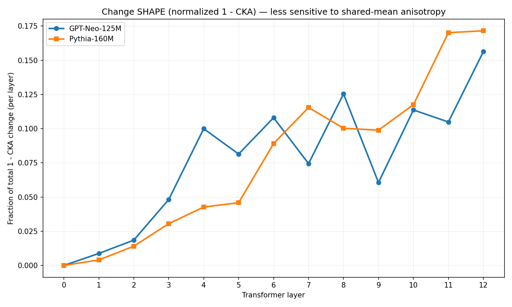

# ERA Screening


ERA tells you where a fine tune changed a language model.

You give it two models: a base model and a version of it that someone
trained further. ERA compares them layer by layer, from the inside, and
shows you where the change is concentrated: near the output, in the
middle of the network, or spread across it.



The picture above is from the proof of concept: two different models fine
tuned on the same data, compared layer by layer. It is a demonstration,
not a calibrated threshold.

## Why this matters

Language models rarely stay as they were released. People take an open
model and train it further on their own data. This is cheap and common, and
the result is a new model whose differences from the original are
usually not documented anywhere.

The standard way to check a modified model is to test its behaviour: ask
questions, score answers. That is necessary but it only sees the outside.
Two models can give similar answers for very different internal reasons.
One may have genuinely reorganised what it knows. Another may have learned
a thin layer of new habits on top of an unchanged interior. From the
outside they can look the same. For safety work the difference matters,
because the two kinds of change fail in different ways and deserve
different scrutiny.

ERA looks at the inside. It reads the internal states of both models on
the same inputs and measures, for every layer of the network, how much
that layer changed. The result is a simple picture: a curve over depth
that says where the fine tune landed.

To be clear about the limits: ERA does not tell you whether a model is
safe or aligned, and it does not decide whether a change is good or bad.
It is a triage tool. It tells auditors, researchers and reviewers where to
look first. In the safety ecosystem it sits
next to behavioural evaluations, not in place of them: behaviour tests say
what changed in the answers, ERA says where the change lives inside the
network.

## Quick start

The models below are examples, not requirements: pass any Hugging Face id
or local path of two related open weight models. The same goes for the
probe sentences, which default to the ones used in the proof of concept
and can be replaced with your own file.

```bash
pip install -e .
# install torch separately (CPU or CUDA): https://pytorch.org/get-started/locally/

# Compare an existing pair of checkpoints (no training involved):
python experiments/run_screening.py \
    --base any/base-model \
    --finetuned path/or/id/of/its-descendant \
    --out results/my_audit \
    --contexts my_probes.txt
```

Or from Python:

```python
from era.models import ModelPair
from era import screen, save
from era.contexts import TEST_CONTEXTS

pair = ModelPair("EleutherAI/gpt-neo-125M", "path/to/finetuned")
result = screen(pair, TEST_CONTEXTS)
print(result.centroids)
save(result, "results/my_audit", extra_config={"seed": 42})
```

To reproduce the full proof of concept (trains 2 models with 3 random
seeds each, about 2 hours on CPU):

```bash
pip install -e .[experiments]
python experiments/10_multiseed_sweep.py
python experiments/11_compare_multiseed.py --tag v2_balanced
```

## How it is built: harness, measures, materials

This design point matters, so it gets its own section. ERA separates
three things that are usually tangled together in research code.

The harness is the part that stays fixed. It loads two related models,
checks that they are actually comparable, runs the probe sentences
through both, extracts the internal states layer by layer, and writes
evidence files with content hashes. This is the plumbing of an audit, and
it is the same no matter what you measure.

The measures are the part that is meant to grow. The four views shipped
today are the set I validated in the proof of concept, and they double as
reference implementations: each one shows what a measure needs in order
to plug into the harness. Distances between output distributions are
already pluggable at runtime; views on internal states have one declared
place in the code where they are computed.

The materials are entirely yours. Which two models to compare, which
sentences to probe them with, which words to track: none of this is baked
in. The core function has no default materials at all, it requires your
contexts explicitly. The models, the probe sentences and the corpus in
this repository are the ones I used to validate the method, and they are
shipped as a bundled example set, used by the demo and the reproducible
experiment, nothing more. When the command line falls back to the example
sentences because you did not pass your own, it tells you.

The separation is the point. An audit instrument is useful only if
auditors can point it at their own models and their own concerns. What
this repository fixes is the discipline (comparability checks, evidence
files, hashes, tested measures), not the content.

## What it measures

Every screening produces, precisely:

| What | Form | Question it answers |
|---|---|---|
| Output drift | one value per probe context | how much did the next word predictions move? |
| Per token drift | curve over layers | how far did each concept's internal representation move? |
| Relational drift | curve over layers | did the geometry between concepts change? |
| Reorganisation (1 - CKA) | curve over layers | how much did the layer rewrite its encoding as a whole? |
| Anisotropy diagnostics | two curves over layers | how saturated are the angle based measures here? |

The three change curves are each summarised by a depth centroid, one
number saying where along the network the change concentrates. This is
the current validated set, not a closed list: the harness is built so
that other measures can be added, see "Using it as a library" below.

Why is depth informative at all? Because layers of a transformer tend to
specialise. A decade of probing studies has shown, with all the usual
statistical caveats, that early layers deal mostly with surface features
of the text, middle layers with meaning and relations between concepts,
and late layers with preparing the output (Tenney et al. 2019, Hewitt and
Manning 2019, Voita et al. 2019, Geva et al. 2021). So where a fine tune
lands is evidence about what kind of change it made. ERA treats this
mapping as a working hypothesis to test, not as a law: the tool reports
where the change is, the interpretation stays with the auditor.

The views are complementary because each one has known failure modes. In
particular, the angle based measures saturate in layers where the internal
vectors share a dominant common direction, a well documented property of
transformer representations called anisotropy: when all vectors point
roughly the same way, angle differences go to zero regardless of what
actually changed. An earlier version of these results was affected by
exactly this. The fourth view is based on CKA, which centres the
representations before comparing them and therefore removes the shared
direction, so depth claims rely mainly on it. Every report also includes
the per layer anisotropy values of both models, so saturated regions are
visible instead of being silently read as absence of change. How this
problem was found and corrected is documented in
[docs/HISTORY.md](docs/HISTORY.md).

The paper-specific fixed-support quantities (`B`, `B_alpha`, `B_k`, `B_T`,
its between/within decomposition, `SI`/`Delta SI`, and `G_l`) are documented
separately in [docs/PAPER_METRICS.md](docs/PAPER_METRICS.md). They are reported
side by side and are not collapsed into an Alignment Score.

## What you need and what you get

ERA reads internal states, so it needs open weights: models you can run
yourself, not models behind an API. The two checkpoints must be related,
meaning same architecture, same number of layers, same vocabulary. If they
are not comparable, loading fails immediately with a clear message.

Every run writes plain files that a reviewer can open without running any
code: two CSV files with the curves and the per context detail, and a JSON
file with the configuration and a fingerprint over it. The audit command
line records hashes or identities for the inputs it controls: probe
contexts, probe vocabulary, local checkpoint weights, the tokenizer
mapping, model revisions, and the relevant runtime versions. The
reproducible training sweep additionally records the training corpus
hash. If you call the library directly from Python, the fingerprint
covers what the pipeline itself knows plus whatever you add through
extra_config, and the docstring of config_fingerprint states that scope
exactly. A fingerprint certifies what it covers, nothing more. The reference data behind the reported proof of concept findings is
versioned under [results/](results/README.md), together with an explicit
statement of what that historical record does and does not make
verifiable.

A note on cost: "lightweight" refers to the method, not to zero compute.
A screening runs a couple of forward passes per probe context per
candidate word, which means minutes on CPU for models of this size.

## Layout

```
era/
├── metrics.py    # the four measures, with references and hand checked math
├── pipeline.py   # screen() -> ScreeningResult
├── report.py     # save() -> CSV and JSON evidence files
├── models.py     # ModelPair, the only file that touches torch
└── contexts.py   # the fixed probe sentences
experiments/      # command line audit + reproducible experiments
tests/            # every metric tested against values computed by hand
data/             # the training corpora used in the proof of concept
docs/             # findings, history, roadmap
```

If you want to understand the method, read `era/metrics.py` next to
`tests/test_metrics.py`. Every measure has a test whose expected value was
computed by hand, so you can check the math with pen and paper.

## Using it as a library

ERA is an audit instrument first and a small library second. The four
measures it ships are the set I validated for the proof of concept. They
are also reference implementations: each one shows exactly what a measure
needs in order to plug into the harness, from the function signature to
the hand computed test. The instrument itself is agnostic about most of
what you pass in.

What you choose: the two models, the probe contexts (your own sentences,
one per line), the probe vocabulary for confirmatory runs, the size of the
compared distributions, and the distance used to compare the output
distributions. Nothing is tied to the models I validated on: GPT-Neo and
Pythia appear in this repository only as the proof of concept panel and in
examples. `ModelPair` accepts any pair of related open weight causal
language models, whatever their family, as long as the two checkpoints
share architecture, layer count and vocabulary. The structural checks read
the model configuration in a family agnostic way, so GPT-2 style, NeoX
style and LLaMA style models all load the same way.
Distances are selected by name from a registry, and you can register your
own at runtime without forking anything:

```python
from era.metrics import DISTRIBUTION_METRICS
from era import screen

def total_variation(p, q, log_base=None):
    union = set(p) | set(q)
    ps, qs = sum(p.values()), sum(q.values())
    return 0.5 * sum(abs(p.get(t, 0) / ps - q.get(t, 0) / qs) for t in union)

DISTRIBUTION_METRICS["total_variation"] = total_variation
result = screen(pair, contexts, distribution_metric="total_variation")
```

The name of the metric ends up in the report, so a reviewer can see what
was used. The per layer views (the four curves) are currently fixed; they
live in one function, `_layer_curves` in `era/pipeline.py`, and adding a
view means adding a curve there, a field on `ScreeningResult` and a column
in the report. Making these pluggable too is on the roadmap.

What you should not pass, and what happens if you do: two unrelated
architectures are rejected at load, before any weights are read. Models
behind an API cannot be screened at all, because ERA needs the internal
states. Probe words that are not a single token are rejected explicitly
rather than silently truncated. A distance that is undefined when the two
models predict different words (as raw KL is) will break on real inputs,
which is why the default is a bounded divergence computed against the
average of the two distributions. And curves measured on different probe
corpora are not comparable with each other, so the report records a
content hash of everything that influenced the measurement.

For contributions to the repository itself, the bar is in
[CONTRIBUTING.md](CONTRIBUTING.md): a test with an expected value computed
by hand, notes on the blind spots of your measure (every measure has
them), and if your change alters what any reported number means, a bump of
the measurement schema version so cached results are never silently mixed.

## Where this is going

Everything above is what works today, measured and independently
reviewed. This section is direction, not capability.

A fine tuned model is one edge in a family tree: a parent model and its
descendant. ERA currently measures that single edge. The longer term goal
is the full tree. Models are increasingly derived from other models,
including fine tunes of fine tunes, and the provenance of these
derivations is usually limited to a note on a model card. A genealogy
where every derivation carries its measurements, meaning what changed
between parent and child, where, and how much, recorded in files anyone
can verify, would make auditing a model lineage a routine check instead
of a reconstruction effort.

The reports are plain files with content hashes for this reason: a
verifiable measurement of one edge is the building block of that graph.
The concrete steps are in [docs/ROADMAP.md](docs/ROADMAP.md). Issues and
pull requests are welcome.

## Status and limits

Validated so far on two small models (GPT-Neo-125M and Pythia-160M), one
type of intervention, three seeds. Thresholds are not calibrated. No
claims of robustness against an adversary who knows the tool. Reading a
late concentration of change as "shallow learning" is a hypothesis under
test, not a result. The earlier version of this code, including the
mistakes that led to the current design, lives in an archived repository
and is documented in [docs/HISTORY.md](docs/HISTORY.md).

## References

On layer specialisation, which is what makes depth informative: Tenney,
Das and Pavlick, "BERT Rediscovers the Classical NLP Pipeline" (ACL 2019);
Hewitt and Manning, "A Structural Probe for Finding Syntax in Word
Representations" (NAACL 2019); Voita, Sennrich and Titov, "The Bottom-up
Evolution of Representations in the Transformer" (EMNLP 2019); Geva et
al., "Transformer Feed-Forward Layers Are Key-Value Memories" (EMNLP
2021). On comparing representations: Kornblith et al., "Similarity of
Neural Network Representations Revisited" (ICML 2019), the source of
linear CKA. On anisotropy: Ethayarajh, "How Contextual are Contextualized
Word Representations?" (EMNLP 2019). On the bounded divergence used for
output drift: Lin, "Divergence Measures Based on the Shannon Entropy"
(IEEE Trans. Inf. Theory, 1991).

## License

MIT, see [LICENSE](LICENSE).
