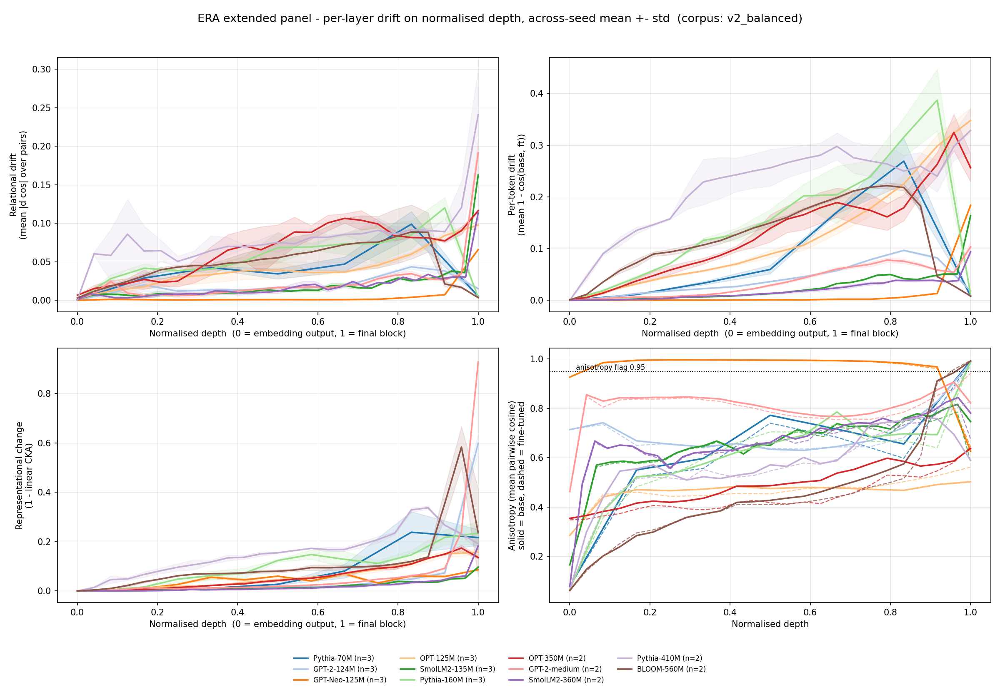
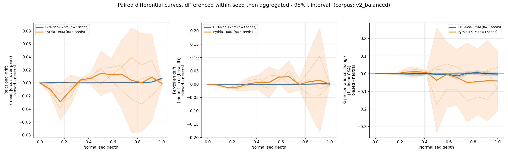

# Findings — extended cross-architecture study (corpus `v2_balanced`)

_2026-08-20. Panel: 11 models, 28 sweep cells, 15 control cells, all measured
on one RTX 5090 pod. Evaluated against `docs/PREDICTIONS.md` and its three
amendments, hypothesis by hypothesis._

Every claim below is written against a prediction that was committed before
the data existed. Where a prediction failed, it is reported in the same place
and at the same length as the ones that held.

---

## Abstract

**The depth profile this study measures is a property of the fine-tuning
regime and the corpus format, not of the injected bias.** On both reference
models the full-unfreeze `1 − CKA` centroid and the neutral-corpus centroid
are the same number to within 0.03 in normalised depth — GPT-Neo 0.656
against 0.653, Pythia 0.715 against 0.737. §7.4 fixed the meaning of this
outcome in advance: within ±0.15, "the depth profile is a property of the
**regime and format**, not of the injected bias, and every depth claim in the
study must be restated in those terms." The threshold was not approached, it
was cleared by an order of magnitude. Section 4.3 does the restating.

Four further outcomes:

* **H1 splits.** The mechanism holds and the summary statistic does not.
  Relational drift inside doubly-saturated layers is lower than in
  unsaturated layers in all five models that have such layers (H1.3, amended
  — confirmed), and 5 of 11 models carry a saturated layer (H1.2 —
  confirmed). But the per-layer correlation between base anisotropy and
  relational drift is negative in only **2 of 11** models, where a majority
  was predicted. **H1.1 is falsified.**
* **H2-descriptive holds, H2-anchored is vacuous.** All 11 models have a
  normalised `1 − CKA` centroid above 0.6. The anchored test passes, but the
  shallow anchor turned out to be degenerate — exactly 1.0000 by
  construction — so the test had almost no power to fail. Reported as a
  defect of the anchor, not as a confirmation.
* **H3's preregistered null holds, and the observed trend is not
  distinguishable from estimator bias.** Section 5.
* **D1 and D2, the study's only directional predictions, are falsified.**
  Section 6.

A synthetic sensitivity calibration identifies a second methodological
confound: on 10 of 11 models, the reported peak `1 − CKA` maps to an unbiased
estimate 1.34×–1.74× larger. GPT-2-medium yields 1.08× because the calibrated
value is compressed against the upper bound. The artefact grows with `d/n`,
subject to this boundary effect.

---

## 1. What was measured

| Model | Tier | Params | Blocks | Hidden | Positional | Seeds |
|---|---|---:|---:|---:|---|---:|
| Pythia-70M | A | 70,426,624 | 6 | 512 | rotary | 3 |
| GPT-2-124M | A | 124,439,808 | 12 | 768 | learned absolute | 3 |
| GPT-Neo-125M | reference | 125,198,592 | 12 | 768 | learned absolute | 3 |
| OPT-125M | A | 125,239,296 | 12 | 768 | learned absolute | 3 |
| SmolLM2-135M | A | 134,515,008 | 30 | 576 | rotary | 3 |
| Pythia-160M | reference | 162,322,944 | 12 | 768 | rotary | 3 |
| OPT-350M | B | 331,196,416 | 24 | 1024 | learned absolute | **2** |
| GPT-2-medium | B | 354,823,168 | 24 | 1024 | learned absolute | **2** |
| SmolLM2-360M | B | 361,821,120 | 32 | 960 | rotary | **2** |
| Pythia-410M | B | 405,334,016 | 24 | 1024 | rotary | **2** |
| BLOOM-560M | B | 559,214,592 | 24 | 1024 | alibi | **2** |

**Tier B cells carry `n_seeds = 2`.** Every band, interval and standard
deviation on those five rows is estimated from two points. They are shown
because excluding them would be worse, and marked in bold everywhere they
appear so no table can be read as if they were three-seed cells.

No model was skipped: all 11 that passed the census completed the sweep, so
the §5 gate G3 list of skipped models is empty.

Provenance: every input number was measured on `cuda`, RTX 5090, torch
2.8.0+cu128, transformers 4.39.3. The aggregation in
`14_compare_extended.py` is numpy/pandas only and recomputes no measurement;
it reuses `11_compare_multiseed.py`'s loaders, so every centroid also
appearing in a script-11 report is the same number.

---

## 2. Gates

**G1c — calibration controls: passed.** Control A (serialization) was neutral
to floating-point noise on both reference models: maximum absolute logit
delta exactly 0.0, maximum per-token drift 6.5e-17, maximum `1 − CKA` change
2.2e-16, against a 1e-6 tolerance. Controls B and C completed on both
reference models across all three seeds, with trainable parameters recorded
by name and the tying branch verified from the written manifest.

**G2 — across-seed stability: passed.** The largest across-seed normalised
`1 − CKA` centroid standard deviation anywhere on the panel is **0.0217**
(BLOOM-560M, `n_seeds = 2`), against a threshold of 0.08. Depth localisation
is stable across seeds in every model. Section 6.4 notes that this stability
does *not* extend to the behavioural measurement.

---

## 3. H1 — generality of the anisotropy confound

### 3.1 H1.1 — falsified

*Prediction:* across swept models, the per-layer Spearman correlation between
base anisotropy and relational drift magnitude is negative in the majority
(> 50%) of models.

*Observed:* negative in **2 of 11**.

| Model | mean Spearman rho | per-seed |
|---|---:|---|
| SmolLM2-135M | +0.921 | 0.939, 0.944, 0.879 |
| SmolLM2-360M **(n=2)** | +0.853 | 0.848, 0.858 |
| OPT-350M **(n=2)** | +0.840 | 0.755, 0.924 |
| Pythia-410M **(n=2)** | +0.723 | 0.828, 0.618 |
| OPT-125M | +0.698 | 0.632, 0.676, 0.786 |
| Pythia-160M | +0.553 | 0.588, 0.566, 0.505 |
| BLOOM-560M **(n=2)** | +0.452 | 0.461, 0.442 |
| Pythia-70M | +0.143 | 0.071, 0.214, 0.143 |
| GPT-2-124M | +0.128 | 0.247, 0.071, 0.066 |
| GPT-2-medium **(n=2)** | −0.160 | −0.161, −0.159 |
| GPT-Neo-125M | **−0.577** | −0.588, −0.566, −0.577 |

The prediction is falsified, and not marginally: nine of eleven models
correlate *positively*, four of them above +0.7. Per §6, this narrows the
methodological takeaway of `FINDINGS_v2_balanced.md` rather than overturning
it — see 3.3.

**An interpretive caveat that does not rescue the prediction.** Both
variables rise with depth in most architectures: anisotropy grows towards the
final block, and so does drift. A Spearman taken across layers therefore
conflates the compression mechanism with a shared depth trend, and in a model
where the depth trend dominates it will read positive whether or not the
compression is present. This is a weakness of H1.1 as designed, not a reason
to reinterpret its outcome: the statistic was preregistered, it was computed
as specified, and it failed. It is noted because H1.3, which conditions on
saturation rather than correlating across depth, is the test that isolates
the mechanism — and it holds.

### 3.2 H1.2 — confirmed

*Prediction:* at least 4 of the 11 panel models have at least one layer with
base anisotropy ≥ 0.95.

*Observed:* **5 of 11** — GPT-Neo-125M (33 of 39 layer-seed rows),
Pythia-70M (3/21), GPT-2-124M (3/39), Pythia-160M (3/39), BLOOM-560M
**(n=2)** (2/50).

GPT-Neo-125M is the extreme case by a wide margin: it is saturated at 11 of
its 13 curve points, its minimum certified ceiling is **0.0066**, and it is
also the model with the latest relational centroid on the panel (0.927
normalised). Those two facts about the same model are the subject of 3.3.

### 3.3 H1.3 (amended) — confirmed, and it is the load-bearing one

*Prediction:* in layers where **both** `anisotropy_base` and `anisotropy_ft`
are ≥ 0.95, mean relational drift is lower than in that model's
`neither`-class layers.

| Model | `both` layers | mean relational | `neither` layers | mean relational | ratio |
|---|---:|---:|---:|---:|---:|
| GPT-Neo-125M | 33 | 0.0018 | 6 | 0.0329 | 18.3× |
| Pythia-160M | 3 | 0.0039 | 36 | 0.0575 | 14.7× |
| BLOOM-560M **(n=2)** | 2 | 0.0035 | 46 | 0.0505 | 14.4× |
| Pythia-70M | 3 | 0.0052 | 18 | 0.0421 | 8.1× |
| GPT-2-124M | 3 | 0.0152 | 36 | 0.0195 | 1.3× |

Confirmed in all five models. **No `base_only` layer exists anywhere on the
panel**: `anisotropy_ft` tracks `anisotropy_base` closely enough that the
fine-tune never opened up a near-collinear layer. The phenomenon §8.4 said
would be reportable if it occurred did not occur. Consistent with the absence
of `base_only` rows, the overlay's fine-tuned anisotropy profiles (dashed)
closely track their base counterparts (solid) across the panel: no saturated
base layer crosses below the 0.95 threshold after fine-tuning.

**Figure 1 — the panel on normalised depth.** The three drift metrics and the
anisotropy profiles, across-seed mean ± std, on a 0–1 depth axis. The bottom
right panel is the one this section rests on: GPT-Neo (orange) sits at or
above the 0.95 flag across almost its whole depth, and every model's dashed
fine-tuned profile lies on top of its solid base profile.



**The certificate, not the flag.** Across 536 layer-seed rows the measured
relational drift never exceeded its own certified ceiling — **zero lemma
violations** — as inequality (2) of `docs/SATURATION_LEMMA.md` requires
pointwise and unconditionally. The ceilings are not uniformly tight:

| Model | rows flagged | max headroom used | median headroom used | min ceiling |
|---|---:|---:|---:|---:|
| GPT-Neo-125M | 33/39 | 0.118 | 0.089 | **0.0066** |
| BLOOM-560M **(n=2)** | 4/50 | 0.265 | 0.043 | 0.0130 |
| Pythia-70M | 3/21 | 0.274 | 0.067 | 0.0196 |
| Pythia-160M | 3/39 | 0.187 | 0.094 | 0.0200 |
| GPT-2-124M | 3/39 | 0.360 | 0.025 | 0.0423 |
| GPT-2-medium **(n=2)** | 1/50 | 0.823 | 0.039 | 0.2140 |
| SmolLM2-360M **(n=2)** | 0/66 | 0.219 | 0.019 | 0.3346 |
| SmolLM2-135M | 0/93 | 0.246 | 0.018 | 0.3891 |
| Pythia-410M **(n=2)** | 0/50 | 0.506 | 0.088 | 0.4146 |
| OPT-350M **(n=2)** | 0/50 | 0.164 | 0.077 | 0.7164 |
| OPT-125M | 0/39 | 0.107 | 0.036 | 0.9157 |

**What this licenses and what it does not.** GPT-Neo's very late relational
centroid (0.927) sits on a model whose ceiling collapses to 0.0066 across
most of its depth. The near-zero relational drift reported in its early and
middle layers is *not* evidence that little changed there; the metric had
almost no room to report change. The same reading does not apply to
OPT-125M, whose minimum ceiling is 0.92 and whose near-zero early drift is
therefore genuine evidence of little change. **Any cross-model comparison of
relational-drift depth on this panel must be stratified by ceiling**, and
comparing GPT-Neo's relational curve to OPT-125M's without that
stratification compares a compressed measurement with an uncompressed one.

The narrowed takeaway: the anisotropy confound is **real, mechanically
confirmed, and concentrated** — it binds severely in a minority of
architectures rather than being the general property H1.1 predicted.

---

## 4. H2 — generality of the late CKA centroid

### 4.1 H2-descriptive — confirmed

*Prediction:* at least 70% of swept models have a normalised `1 − CKA`
centroid > 0.6.

*Observed:* **11 of 11, 100%.** The minimum is 0.654 (Pythia-410M,
`n_seeds = 2`).

| Model | normalised `1 − CKA` centroid | normalised relational centroid |
|---|---:|---:|
| GPT-2-124M | 0.916 ± 0.007 | 0.633 ± 0.007 |
| GPT-2-medium **(n=2)** | 0.887 ± 0.002 | 0.738 ± 0.030 |
| Pythia-70M | 0.839 ± 0.008 | 0.602 ± 0.024 |
| SmolLM2-360M **(n=2)** | 0.831 ± 0.016 | 0.717 ± 0.024 |
| SmolLM2-135M | 0.779 ± 0.016 | 0.742 ± 0.024 |
| OPT-125M | 0.760 ± 0.001 | 0.681 ± 0.028 |
| OPT-350M **(n=2)** | 0.757 ± 0.001 | 0.638 ± 0.035 |
| BLOOM-560M **(n=2)** | 0.733 ± 0.022 | 0.565 ± 0.028 |
| Pythia-160M | 0.715 ± 0.018 | 0.600 ± 0.028 |
| GPT-Neo-125M | 0.656 ± 0.005 | 0.927 ± 0.004 |
| Pythia-410M **(n=2)** | 0.654 ± 0.008 | 0.600 ± 0.016 |

The centroids cluster late across every architecture family, positional
encoding and scale in the panel. As §7.4 said when it demoted this test: it
establishes that they cluster late; it cannot say what late *means*, because
the scale is uncalibrated.

### 4.2 H2-anchored — passes, and the pass is close to meaningless

*Prediction:* the full-unfreeze centroid is strictly earlier than
`anchor_shallow` by more than 0.10 in normalised depth.

| Model | full-unfreeze | `anchor_shallow` | margin | verdict |
|---|---:|---:|---:|---|
| GPT-Neo-125M | 0.656 | 1.0000 | +0.344 | passes |
| Pythia-160M | 0.715 | 1.0000 | +0.285 | passes |

**The anchor is degenerate.** Control C's `1 − CKA` curve is *exactly zero at
every layer except the last*: for GPT-Neo, twelve zeros and 0.001034; for
Pythia, twelve zeros and 0.023658. Training only the final block changes only
the final layer's representation, so the centroid is 1.0 by construction, not
by measurement, and its across-seed standard deviation is exactly 0.0000.

Consequently the test as preregistered could only have failed if a
full-unfreeze centroid landed above 0.90. Nothing on the panel is close. The
anchor does establish the top of the scale — it says exactly where
"maximally late" is, and that is worth having — but the >0.10 margin test
carries almost no information, and reporting its pass as a confirmation of
H2 would overstate what happened. **The preregistered spot-check on OPT-125M
(predicted > 0.85) reads 1.0000 as well**, one seed, degenerate for the same
reason: the shallow anchor is *not* architecture-specific, but that finding
comes for free from the construction rather than from the measurement.

### 4.3 H2-content — triggered, and this is the study's headline

*Prediction (§7.4):* if the full-unfreeze centroid and `anchor_domain` are
within ±0.15, "the depth profile is a property of the **regime and format**,
not of the injected bias, and every depth claim in the study must be restated
in those terms."

| Model | full-unfreeze | `anchor_domain` (neutral corpus) | difference |
|---|---:|---:|---:|
| GPT-Neo-125M | 0.6557 ± 0.0052 | 0.6533 ± 0.0055 | **+0.0024** |
| Pythia-160M | 0.7148 ± 0.0181 | 0.7369 ± 0.0115 | **−0.0221** |

The differences are 1.6% and 15% of the ±0.15 band. On GPT-Neo the two
centroids differ by less than the across-seed standard deviation of either.
One asymmetry of the control rides alongside this result: the substitutes
fragment into more BPE pieces, so the neutral run computes its loss over
about 10% more active tokens than the biased run at identical optimizer
steps — a confounder declared in advance with no predicted direction (§9.2,
per-model percentages in `results/census/neutral_substitute_selection.json`).

**The paired differential curves** — the primary deliverable of the
calibration phase per §7.2, superseding the raw biased curve as the headline
figure for the reference models — say the same thing layer by layer.
Differences are taken within seed and only then aggregated; no centroid is
computed on them, because a centre of mass over a signed curve reports where
the positive and negative lobes cancel, which is not a depth.

Intervals are two-sided Student-t intervals over the three within-seed paired
differences at each layer.

| Model | metric | unanimous sign across seeds | 95% interval excludes 0 |
|---|---|---:|---:|
| GPT-Neo-125M | relational | 12/13 layers | 7/13 layers |
| GPT-Neo-125M | per-token | 10/13 | 5/13 |
| GPT-Neo-125M | `1 − CKA` | 5/13 | **0/13** |
| Pythia-160M | relational | 8/13 | 4/13 |
| Pythia-160M | per-token | 6/13 | 2/13 |
| Pythia-160M | `1 − CKA` | 4/13 | **0/13** |

On `1 − CKA`, no layer in either reference model has a 95% paired-seed t
interval excluding zero, but the evidential strength differs sharply.
GPT-Neo's intervals are narrow and remain close to zero, giving a precise
estimate of a small residual at this experiment's resolution. Pythia's
intervals widen substantially after mid-depth, so its 0/13 result reflects
low layerwise precision rather than evidence of equality. The preregistered
centroid-band criterion is triggered for both models; layerwise equivalence
is not claimed.

The residual that does survive is on the cosine-based views and is small: on
GPT-Neo the relational differential peaks at +0.0070 against a raw curve that
peaks at 0.0659, roughly a tenth of the signal.

**Figure 2 — the paired differential curves.** Biased minus neutral,
differenced within seed and then aggregated: thin lines are the three
per-seed differences, the bold line their mean, the band the 95% t interval.
The contrast between the two models is the point — GPT-Neo (blue) hugs zero
with a band narrow enough to be informative, while Pythia (orange) carries
structure inside intervals wide enough to contain it.



#### The restatement §7.4 requires

Every depth claim in this study is hereby restated as a claim about the
**full-unfreeze regime applied to a 300-sentence corpus of this format**, and
not about gendered content:

1. "Full-unfreeze fine-tuning on this corpus produces a late `1 − CKA`
   centroid" stands. "…because of the bias it installs" does not: a corpus
   with the gendered content substituted out produces the same centroid.
2. The cross-architecture generality of §4.1 is generality of the *regime's*
   depth signature across architectures, not of a bias signature.
3. `FINDINGS_v2_balanced.md`'s depth reading for the reference pair inherits
   this restriction in full.
4. What the instrument localises here is where *this training procedure*
   reorganises representations. Distinguishing the content would require a
   contrast this design does not contain, because the only available contrast
   — biased against neutral — cancels on the primary metric.

**This is not a null result about ERA.** The instrument measured a real,
seed-stable, cross-architecture depth signature (G2 std ≤ 0.0217) and the
paired control is what identified whose signature it is. That identification
is the finding; it was available only because the control was preregistered
and run.

---

## 5. H3 — scaling within a family

*Prediction: none — the null.* §4 states that no mechanism was proposed by
which scale should move the centroid, that the hypothesis cannot be tested
statistically with 3 and 2 points, and that it gets no p-value, no fitted
trend, and not the word "significant". Those constraints are honoured here.

**Observed, Pythia family (`n_seeds = 3, 3, 2`):**

| Model | hidden | normalised `1 − CKA` centroid | normalised relational centroid |
|---|---:|---:|---:|
| Pythia-70M | 512 | 0.839 | 0.6024 |
| Pythia-160M | 768 | 0.715 | 0.6002 |
| Pythia-410M **(n=2)** | 1024 | 0.654 | 0.6001 |

**Observed, GPT-2 family:**

| Model | hidden | normalised `1 − CKA` centroid | normalised relational centroid |
|---|---:|---:|---:|
| GPT-2-124M | 768 | 0.916 | 0.633 |
| GPT-2-medium **(n=2)** | 1024 | 0.887 | 0.738 |

### The Pythia trend is not distinguishable from estimator bias

This is the point on which H3 turns, and it is stated as an emphasis rather
than as a hedge.

**The trend exists only on the metric whose bias grows with `d/n`.** The
Pythia `1 − CKA` centroid falls monotonically with width, 0.839 → 0.715 →
0.654. The calibrated inflation factor of the CKA estimator over exactly
those three models rises monotonically with `d/n`: **1.34× → 1.53× →
1.71×**. The metric that moves and the artefact that moves are indexed by the
same architectural variable, in the same direction, across the same three
points.

**The trend is absent on the metric that is not subject to that bias.** The
Pythia relational centroid over the same three models is **0.6024, 0.6002,
0.6001** — flat to the third decimal place, a spread of 0.0023 against
across-seed standard deviations of 0.024, 0.028 and 0.016. Whatever moves the
CKA centroid across Pythia scales leaves the cosine-based depth measurement
untouched.

**Across the panel there is no association at all.** Normalised centroid
against `hidden_size` over 11 models: relational r = −0.147 (p = 0.665),
`1 − CKA` r = −0.152 (p = 0.655), per-token r = −0.368 (p = 0.266). Against
`n_blocks` and `n_params`, likewise nothing. The apparent within-family
monotonicity does not survive contact with the full panel.

**Conclusion. The preregistered null holds.** The observed direction is
reported, as §4 requires: within the Pythia family the `1 − CKA` centroid
moves earlier as the model widens. It is reported as **not distinguishable
from the estimator bias that scales with the same variable**, and no
mechanism is claimed. The family p-values are not printed at all: three
perfectly ordered points give Spearman rho = 1 out of six possible orderings,
and a p-value on that is a number without a meaning.

**This is the twin of the anisotropy finding.** In `FINDINGS_v2_balanced.md`
the cosine-based curves' *shape* was found to track each architecture's
anisotropy profile, and `1 − CKA` was promoted to primary depth view
precisely because it is insensitive to the shared mean direction. The
extended panel now finds that `1 − CKA` carries its own architecture-scaling
confound: the estimator's bias grows with hidden size against sample count.
Second metric, second confound that scales with the architecture, same
lesson — **a depth difference between two architectures is a claim about the
estimator until it is shown not to be.** Neither of the two primary views is
free of an architecture-indexed artefact, and the correct response is the
same one taken for anisotropy: measure the artefact, publish it next to the
number, and stratify every cross-model comparison by it.

### The CKA estimator bias, measured

`era.metrics.linear_cka` is the standard biased estimator, documented as
biased in the high-dimension / low-sample regime. This panel sits squarely in
that regime: hidden sizes 512–1024 against 1304–1497 CKA samples, `d/n` from
0.34 to 0.74. `14_compare_extended.py` implements the unbiased HSIC estimator
(Song et al., 2007), exercises both against cases with known answers, and
calibrates each model at its own `(n, d)` and at the similarity its cells
actually report.

| Model | `d/n` | CKA at null, biased | max `1 − CKA` reported | calibrated | inflation |
|---|---:|---:|---:|---:|---:|
| Pythia-70M | 0.34 | 0.257 | 0.238 | 0.320 | **1.34×** |
| SmolLM2-135M | 0.44 | 0.305 | 0.097 | 0.139 | 1.44× |
| Pythia-160M | 0.53 | 0.345 | 0.234 | 0.357 | 1.53× |
| OPT-125M | 0.56 | 0.359 | 0.157 | 0.245 | 1.56× |
| GPT-2-124M | 0.56 | 0.359 | 0.598 | 0.932 | 1.56× |
| GPT-Neo-125M | 0.57 | 0.362 | 0.086 | 0.135 | 1.57× |
| BLOOM-560M **(n=2)** | 0.71 | 0.414 | 0.584 | 0.996 | 1.71× |
| Pythia-410M **(n=2)** | 0.71 | 0.415 | 0.337 | 0.576 | 1.71× |
| SmolLM2-360M **(n=2)** | 0.72 | 0.419 | 0.182 | 0.313 | 1.72× |
| GPT-2-medium **(n=2)** | 0.73 | 0.423 | 0.928 | 0.999 | 1.08× † |
| OPT-350M **(n=2)** | 0.74 | 0.426 | 0.174 | 0.302 | **1.74×** |

† GPT-2-medium's calibrated value is against the top of the scale, so its
inflation factor is compressed by the bound rather than being small.

Two readings, both needed. The **null column** says what the estimator
reports for two representations that share nothing: between 0.26 and 0.43
instead of 0. That is a property of `(n, d)` and *not* a threshold the
observed change should be compared against — the bias falls as true
similarity rises, and every cell here sits above 0.9. The **calibrated
column** is the number that matters: read at the similarity actually
reported, the unbiased estimator would report 34% to 74% more change.

**This is a calibration, not a correction.** It is derived from isotropic
Gaussian draws while real hidden states are strongly anisotropic. Nothing is
written back into a published curve, no centroid is recomputed from it, and
no result in this document is restated using calibrated values. It bounds the
order of magnitude of the artefact and shows that the artefact is indexed by
architecture width. Recomputing the curves properly would require the raw
per-layer hidden states, which the pipeline does not retain — that is the
work item, recorded in section 8.

---

## 6. Behavioural checks D1–D3 — the one signed space

Every representational curve here is unsigned, so no drift curve carries a
directional prediction. The single signed quantity is behavioural: the
leadership-versus-support contrast of §9.5, measured on a checkpoint, with
`Δgap = gap(fine-tuned) − gap(base)`.

```
D1  FAIL          5/6 cells satisfied
D2  FAIL          2/6 cells satisfied
D3  NOT-COMPUTED  5/6 cells satisfied, 0 by the test it was meant to apply
```

| Model | seed | Δgap biased (man/woman) | Δgap neutral (highl./lowl.) | Δgap neutral (man/woman) | D1 | D2 |
|---|---|---:|---:|---:|---|---|
| GPT-Neo | 42 | +1.6585 | −0.4870 | −1.0493 | ok | **falsified** |
| GPT-Neo | 43 | +2.1031 | −0.4993 | −1.2956 | ok | **falsified** |
| GPT-Neo | 44 | +1.3819 | −0.4476 | −1.1947 | ok | **falsified** |
| Pythia | 42 | +0.7374 | −0.1692 | −1.6276 | ok | **falsified** |
| Pythia | 43 | **−1.2000** | +0.0125 | −1.5466 | **falsified** | ok |
| Pythia | 44 | +0.4233 | +0.2090 | −0.6694 | ok | ok |

### 6.1 D1 — falsified by one cell

*Prediction:* after fine-tuning on the biased corpus, `Δgap(man, woman) > 0`
for both reference models at every seed; falsified if ≤ 0 for any
model/seed.

Pythia seed 43 gives **−1.2000**: the biased fine-tune moved the contrast in
the *opposite* direction. The other five cells range from +0.42 to +2.10.

§9.5 states what a D1 failure means: it "would mean the corpus did not
install the association the whole study assumes it installs, and would
invalidate the premise before any depth question." That reading applies to
one cell of six, not to all six, and the honest summary is narrower than the
preregistered sentence: the corpus installs the intended association in most
runs but not reliably, and one seed in six reversed it.

### 6.2 Control C, reported next to D1

The localization control — final block only, `PARTIAL_UNFREEZE_LAST_BLOCK`,
biased corpus — moved the gendered contrast **positively in all six cells**:

| Model | seed 42 | seed 43 | seed 44 |
|---|---:|---:|---:|
| GPT-Neo-125M | +0.0950 | +0.0765 | +0.0909 |
| Pythia-160M | +0.9483 | +0.7434 | +0.8475 |

**The shallow patch installs the behaviour more consistently than the deep
reorganisation does**, on this corpus: 6 of 6 positive with tight
within-model spread, against 5 of 6 with a spread on Pythia running from
−1.20 to +0.74. On Pythia the last-block-only regime also produces a *larger*
mean Δgap (+0.846) than full unfreeze (+0.320 across its three seeds).

This is a supplementary observation, not a substitute for D1: Control C is a
different regime and answers a different question. But it is interesting in
its own right, and it points the same way as section 4.3 — the behavioural
outcome and the depth of representational change are not tied together in the
way the study's framing assumed. On this corpus, an output-side patch is
behaviourally the more reliable intervention.

### 6.3 D2 — falsified by four cells of six

*Prediction:* after fine-tuning on the neutral corpus,
`Δgap(highlander, lowlander) > 0`.

The neutral corpus **lowered** its own substitute contrast in GPT-Neo at all
three seeds (−0.45 to −0.50) and in Pythia at seed 42 (−0.17). Only Pythia 43
(+0.0125, indistinguishable from zero) and Pythia 44 (+0.209) are positive.

It is not a broken training run: Control B trained uniformly across all six
cells — 219 optimizer steps each, loss 2.93 → 0.50 on GPT-Neo and 2.33 → 0.47
on Pythia, final eval loss 0.507–0.593.

§9.5's reading is that the neutral corpus is not an equivalent intervention
and the pairing compares an intervention against a non-intervention. **That
reading is qualified here, and the qualification is section 6.5's open
diagnostic, not a rescue.**

**What D2's failure does and does not do to section 4.3.** It does not
invalidate the H2-content finding. The paired subtraction still removes what
a corpus of this shape and this training regime does, which is exactly the
comparison §7.1 built it for, and the differential curves remain the correct
primary deliverable. What it removes is the stronger framing: biased against
neutral is **not** "one intervention against an equivalent intervention". It
is "the intervention against the same procedure with the gendered content
substituted out", and the neutral arm demonstrably did not install a
comparable contrast of its own. Section 4.3 is written in those terms
throughout, and does not rely on the stronger one.

### 6.4 The behaviour/representation dissociation on Pythia

Pythia's three seeds are stable in every representational measurement and
wildly unstable in the behavioural one.

| Pythia-160M, biased | seed 42 | seed 43 | seed 44 |
|---|---:|---:|---:|
| `1 − CKA` centroid (absolute) | 8.468 | 8.829 | 8.436 |
| relational centroid (absolute) | 7.572 | 7.117 | 6.917 |
| **Δgap(man, woman)** | **+0.7374** | **−1.2000** | **+0.4233** |

The drift centroids sit inside a 0.4-layer band. The signed behavioural
contrast swings across nearly two nats and changes sign. The same six
checkpoints produce a seed-stable depth signature and a seed-unstable
behavioural one.

**Two readings are offered, and this document does not choose between them.**

*(a) The behavioural probe is noisy at this corpus scale.* 300 sentences, 219
optimizer steps, and a probe of 40 contexts with a single word pair. A
quantity that is a difference of two means of 20 log-probability contrasts
each has no error bar attached to it in this design, and nothing here
establishes that ±1 nat is outside its run-to-run range. Under this reading
D1's single failure is a sampling event and the dissociation is an artefact
of measurement precision, not a fact about the models.

*(b) The drift measurement captures reorganisation the probe does not.* The
representational metrics integrate over 40 contexts, every candidate token
and every layer; the behavioural gap collapses all of that onto one signed
scalar defined by one word pair. Under this reading the seed-stable depth
signature is real reorganisation, and the behavioural probe is simply a very
narrow readout of it — consistent with section 4.3's finding that the depth
signature belongs to the regime rather than to the specific content, and with
6.2's finding that a shallow patch moves the behaviour more reliably than
deep reorganisation does.

**A ceiling hypothesis, added as a third consideration and not as a
resolution.** Pythia's base gendered gap is already **+1.9876 nats** before
any fine-tuning (GPT-Neo: +2.0259). The intervention is trying to push
further in a direction the base model already strongly prefers, and the
smaller and less consistent Δgap on Pythia (+0.74, −1.20, +0.42 against
GPT-Neo's +1.66, +2.10, +1.38) is compatible with the probe approaching a
ceiling where additional log-probability separation is hard to gain and easy
to lose to noise. This is a hypothesis, it is untested here, and testing it
would need probe contexts on which the base models do *not* already show a
strong contrast.

**What would distinguish the readings.** Repeated seeds beyond three; a
second word pair on the same axis; and per-context variance on the gap, which
`leadership_support_gap` already computes (`leadership_std`, `support_std`)
but which no analysis currently reports.

### 6.5 Measurement convention for the gap, and an open diagnostic

**The convention, declared.** `sequence_logprob`
([02_select_neutral_substitutes.py:144-169](../experiments/02_select_neutral_substitutes.py#L144-L169))
computes the teacher-forced log-probability of the continuation **summed over
all of its subtokens**, not the first token only, and not
length-normalised. `leadership_support_gap` then takes the mean over the 20
leadership contexts minus the mean over the 20 support contexts. Script 16
reuses that function unchanged.

**What the words actually tokenize to**, under both reference tokenizers,
identically:

| word | GPT-Neo-125M | Pythia-160M |
|---|---|---|
| ` man` | 1 token | 1 token |
| ` woman` | 1 token | 1 token |
| ` highlander` | 2: `[' high', 'lander']` | 2: `[' high', 'lander']` |
| ` lowlander` | 2: `[' low', 'lander']` | 2: `[' low', 'lander']` |

Two consequences, both of which qualify D2 and neither of which qualifies D1:

1. **No length bias in the D2 contrast**: both substitute words are two
   tokens, so the summed log-probabilities are over equal token counts.
2. **The contrast is carried largely by a generic adjective.** The shared
   `lander` suffix does not cancel — it is conditioned on different prefixes
   — but the discriminating term is `logP(' high')` against `logP(' low')`,
   and ` high` / ` low` are ordinary adjectives with strong independent
   priors after "A CEO is typically described as a…". D2 may be reading a
   generic adjective preference rather than the terrain identity the corpus
   installed.

**A third asymmetry, prior to both:** D1 is measured on a clean single-token
pair and D2 on a two-token pair sharing a suffix. **They are not measured on
commensurable probes**, and no comparison of their effect sizes is made
anywhere in this document.

#### OPEN DIAGNOSTIC — not yet run

**The test.** Compute `gap` for the bare pair `(' high', ' low')` on the same
40 probe contexts, on the two base models. Inference only, no training, no
checkpoint; it appends to any future pod session and does not justify one on
its own.

**What it would distinguish.**

* If the bare `high`/`low` gap **reproduces** the sign and order of magnitude
  of the `highlander`/`lowlander` gap, then the D2 probe is dominated by the
  generic adjective prior and D2's falsification is **a property of the
  probe, not of the corpus**. The neutral corpus might have installed its
  contrast perfectly well without this probe being able to see it.
* If the bare gap is **substantially different**, the probe is reading the
  substitute identity as intended and D2's falsification is **a property of
  the corpus**: the neutral arm did not install the contrast it was built to
  install, and §9.5's reading stands unqualified.

**Until it is run, D2 is reported as falsified with its cause undetermined
between these two.** Both possibilities are live and the document does not
lean on either.

A second, larger remedy is recorded for any v3: choose substitutes that are
single-token in both tokenizers, which would make D1 and D2 commensurable.
That requires regenerating the neutral corpus and is out of scope here.

### 6.6 D3 — not computed, and never tested

*Prediction:* the neutral run's `Δgap(man, woman)` is smaller than the biased
run's by at least a factor of two, same model and seed.

**The ratio was never computed in a single cell.** The neutral run's gendered
Δgap is negative in all six cells (−0.67 to −1.63), so every cell was decided
by the preregistered degenerate rule `neutral_nonpositive` — the neutral run
did not move the gendered gap in the predicted direction at all, which
satisfies D3's substance. The sixth cell (Pythia 43) is
`biased_nonpositive_not_meaningful`, because D1 had already failed there and a
ratio against a non-effect would read as a pass for the wrong reason.

So: **D3's substance holds in five cells of six; D3's quantitative claim was
tested in zero.** The overall status is NOT-COMPUTED and reporting it as a
pass would be wrong.

The substantive content is worth stating plainly: the neutral corpus reduced
the gendered contrast by 0.67 to 1.63 nats in every cell. The substitution
removed gendered content and the models' gendered contrast fell accordingly.
That is the clearest positive evidence in this section that the neutral
corpus is doing what it was built to do — which sits in direct tension with
D2's falsification, and is a further reason the open diagnostic of 6.5
matters.

### 6.7 A preregistration that was wrong, in the study's favour

Before the run, `16_behavioural_checks.py` recorded a preregistered
expectation that the retrained biased checkpoints would **not** be
bit-identical to the originals, on the grounds that non-deterministic CUDA
kernels make exact reproduction unlikely; the plan was to report D1 and D3 as
measured on "retrained twins" and to carry that caveat into this document.

**Observed: 6 of 6 checkpoints reproduced the recorded `checkpoint_sha256`
exactly.** Same base revision, same seed, same corpus, same hyperparameters,
same GPU — and byte-identical weights.

The caveat is therefore withdrawn: D1 and D3 were computed on the *original*
checkpoints the sweep measured, not on approximations of them. The reversal
is recorded rather than quietly dropped, because a preregistered expectation
that fails in the direction of a stronger result is exactly as much a
deviation from plan as one that fails the other way, and the record should
show both. It also establishes something useful for this pipeline: on fixed
hardware and library versions, full-unfreeze training here is bit-reproducible
from the seed, so a deleted checkpoint is recoverable and verifiable.

---

## 7. Methodological findings

1. **Two primary metrics, two architecture-indexed confounds.** Anisotropy
   compresses the cosine-based views, severely in a minority of models
   (3.3). Estimator bias compresses `1 − CKA`, in proportion to `d/n`, in all
   of them (5). Every cross-architecture depth comparison on this panel must
   be stratified by both, and neither view can be treated as the neutral
   arbiter of the other.
2. **A paired control can identify whose signature a measurement carries**,
   and here it did: the depth profile is the regime's, not the content's
   (4.3). This was only visible because the control was preregistered, run at
   the same seeds, and differenced within seed.
3. **A by-construction anchor can be degenerate.** `anchor_shallow` is 1.0000
   with zero variance because training one block moves one layer. It usefully
   marks the top of the scale and it makes the margin test it was written
   for nearly unfailable (4.2). An anchor should be checked for degeneracy
   before a test is built on it.
4. **The certified ceiling is worth more than the flag it replaced.** Zero
   violations across 536 rows, and the ceiling — not the 0.95 flag —
   distinguishes GPT-Neo's uninterpretable near-zero drift from OPT-125M's
   informative near-zero drift.
5. **Artefacts without provenance are a contamination risk, not just an
   untidiness.** A pre-provenance CPU pilot cell in the working tree
   shadowed the verified 11-model panel on the first analysis run and would
   have overwritten a committed GPU cell on the next export. Recorded in
   `docs/HISTORY.md`, guarded in `docs/RUNBOOK_GPU.md`.

---

## 8. Limits, and what is not claimed

* **Tier B is two seeds.** Five of eleven models. Their standard deviations
  are estimates from two points and are marked throughout.
* **One corpus, one regime, one intervention size.** 300 sentences, 219
  optimizer steps, one learning rate. Section 4.3's finding is about *this*
  regime and format; nothing here establishes how it behaves at other scales.
* **The CKA calibration is synthetic.** Isotropic Gaussian draws against
  strongly anisotropic real hidden states. It bounds an order of magnitude
  and is not written into any curve. Doing it properly needs the raw
  per-layer hidden states, which the pipeline does not retain. **Work item:
  retain a sampled activation tensor per layer, or compute both estimators
  inside `era.pipeline.screen`.**
* **The domain control is not token-balanced.** Optimizer steps are equal by
  construction (219), but the substitutes fragment into more BPE pieces, so
  the neutral run's loss is computed over about 10% more active tokens
  (+9.5% to +14.3% by tokenizer). Preregistered as an unsigned confounder in
  §9.2 — no direction was predicted and none is claimed here.
* **D2's cause is undetermined** between a corpus failure and a probe
  artefact, pending the open diagnostic of 6.5.
* **The behavioural probe carries no error bar.** `leadership_std` and
  `support_std` are computed and never reported. Adding them would let 6.4's
  reading (a) be tested rather than merely offered.
* **No deep/shallow verdict is attached to any centroid**, here or anywhere
  in v2. The instrument localises change; the interpretation is the
  auditor's.
* **Every verdict and every derived number here is reproduced by
  `experiments/17_evaluate_hypotheses.py`**, which recomputes the Spearman
  coefficients, the saturation counts and class means, the anchor
  comparisons and margins, the family trends, the panel correlations and the
  D1–D3 tables from committed artefacts alone — no model, no GPU, no
  simulation rerun — and writes them to
  `results/aggregates/hypothesis_evaluation.json`. The script also emits the
  figures this document quotes, formatted as this document formats them, and
  `--check-findings` reports any that have drifted apart; a test asserts the
  set is empty. The D1–D3 section additionally re-applies script 16's rules
  to its recorded deltas and reports any disagreement rather than preferring
  either file.

---

## 9. Sources

**The two figures are committed copies, not links into a run directory.**
`14_compare_extended.py` writes its artefacts to a timestamped directory, so
a link into one would break at the next run. Figures 1 and 2 are therefore
byte-identical copies placed in `docs/figures/` under stable names, following
the convention `FINDINGS_v2_balanced.md` already uses. Their source is
`results/aggregates/extended_v2_balanced_20260820T005735Z/` —
`extended_overlay_normalised_depth.png` and `extended_differential.png`
respectively. Regenerating the analysis means recopying them; the timestamped
directory remains the provenance of record.

Every number above traces to a committed artefact:

* `results/aggregates/hypothesis_evaluation.json` — the verdicts behind this
  document and every derived number in it, recomputed from the artefacts
  below by `experiments/17_evaluate_hypotheses.py`. Start here.
* `results/aggregates/extended_v2_balanced_20260820T005735Z/` — master table,
  per-layer saturation and ceilings, differential curves, CKA sensitivity,
  overlays. Produced by `experiments/14_compare_extended.py`.
* `results/controls/behavioural_checks_D1_D3.json` — D1–D3, per cell, with
  provenance and criteria. Produced by `experiments/16_behavioural_checks.py`.
* `results/controls/control_{A,B,C}_*/` — the G1c calibration controls.
* `results/sweep/v2_balanced/` — 28 sweep cells.
* `results/census/` — architecture facts and the substitute selection.
* `docs/PREDICTIONS.md` — the predictions all of the above is evaluated
  against, with three pre-data amendments.
