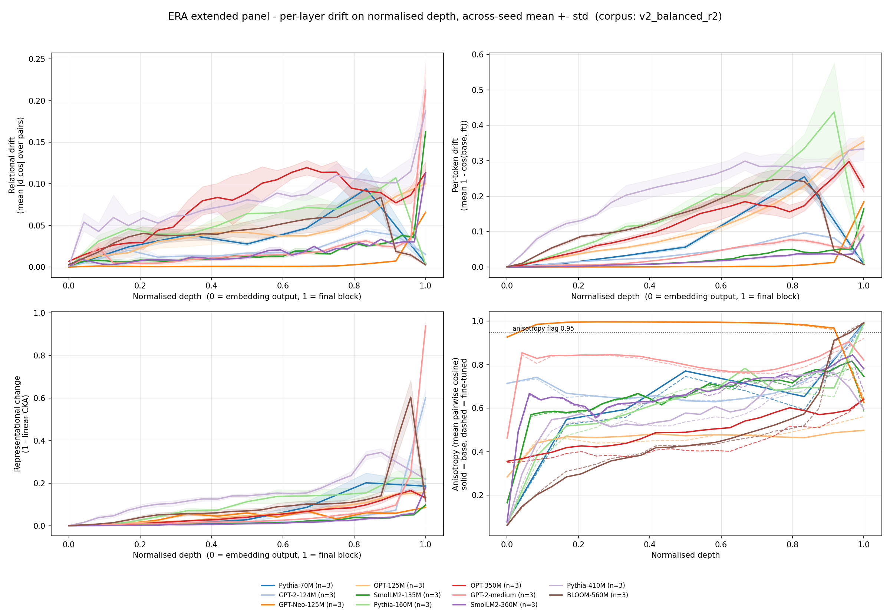
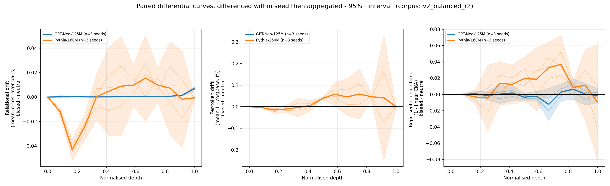

# Findings — extended cross-architecture study (corpus `v2_balanced`)

_2026-08-22. Primary measurement: tag **`v2_balanced_r2`** — 11 models, 33
sweep cells (three seeds each), 15 control cells, measured on one
A100-SXM4-80GB pod, with the exact top-k union and both CKA estimators written
per layer. Evaluated against `docs/PREDICTIONS.md` and its three amendments,
hypothesis by hypothesis._

_**`v2_balanced_r2` is the measurement of record.** Every number below is r2
unless it is explicitly labelled as the earlier run. The first `v2_balanced`
sweep is neither withdrawn nor regenerated: it stays committed under
`results/sweep/v2_balanced/` and
`results/aggregates/extended_v2_balanced_20260820T005735Z/`, and §1.1 reports
exactly how far the two runs differ. Every verdict is unchanged between them._

Every claim below is written against a prediction that was committed before
the data existed. Where a prediction failed, it is reported in the same place
and at the same length as the ones that held.

---

## Abstract

**The two reference models have similar depth centroids under the biased
and neutral corpora. This does not establish a depth signature specific to
the injected bias.** On both reference
models the full-unfreeze `1 − CKA` centroid and the neutral-corpus centroid
are the same number to within 0.03 in normalised depth — GPT-Neo 0.656
against 0.653, Pythia 0.715 against 0.727. §7.4 fixed the meaning of this
outcome in advance: within ±0.15, "the depth profile is a property of the
**regime and format**, not of the injected bias, and every depth claim in the
study must be restated in those terms." The threshold was not approached, it
was cleared by an order of magnitude. Section 4.3 does the restating.
The criterion does not isolate the causal contributions of regime, corpus
format, and gendered content, or establish layerwise equivalence.

Four further outcomes:

* **H1 splits.** The mechanism holds and the summary statistic does not.
  Relational drift inside doubly-saturated layers is lower than in
  unsaturated layers in all five models that have such layers (H1.3, amended
  — confirmed), and 5 of 11 models carry a saturated layer (H1.2 —
  confirmed). But the per-layer correlation between base anisotropy and
  relational drift is negative in only **2 of 11** models, where a majority
  was predicted. **H1.1 is falsified.**
* **H2-descriptive holds, H2-anchored is vacuous.** All 11 models have a
  normalised `1 − CKA` centroid above 0.6. The anchored test passes, but the
  shallow anchor turned out to be degenerate — exactly 1.0000 by
  construction — so the test had almost no power to fail. Reported as a
  defect of the anchor, not as a confirmation.
* **H3's preregistered null holds, and the explanation the first run gave for
  the observed trend has been withdrawn.** The within-family Pythia trend was
  attributed to estimator bias; measured rather than simulated, that bias is
  about 1% and moves the wrong way, so the trend is now recorded as
  unexplained. Section 5.
* **D1 and D2, the study's only directional predictions, are falsified.**
  Section 6.

**A methodological confound the first run reported has been measured away.**
`v2_balanced_r2` computes the unbiased CKA estimator inside the pipeline and
writes it next to the biased one for every layer of every cell, so the
estimator bias no longer has to be simulated. Measured directly, the choice of
estimator moves the reported `1 − CKA` by **0.1% to 2.1%** across all 33
cells — not the **1.34×–1.74×** an isotropic-Gaussian simulation had
projected. Section 5 replaces the simulated calibration with the measurement
and withdraws the reading that the H3 trend was estimator artefact.

---

## 1. What was measured

| Model | Tier | Params | Blocks | Hidden | Positional | Seeds |
|---|---|---:|---:|---:|---|---:|
| Pythia-70M | A | 70,426,624 | 6 | 512 | rotary | 3 |
| GPT-2-124M | A | 124,439,808 | 12 | 768 | learned absolute | 3 |
| GPT-Neo-125M | reference | 125,198,592 | 12 | 768 | learned absolute | 3 |
| OPT-125M | A | 125,239,296 | 12 | 768 | learned absolute | 3 |
| SmolLM2-135M | A | 134,515,008 | 30 | 576 | rotary | 3 |
| Pythia-160M | reference | 162,322,944 | 12 | 768 | rotary | 3 |
| OPT-350M | B | 331,196,416 | 24 | 1024 | learned absolute | 3 |
| GPT-2-medium | B | 354,823,168 | 24 | 1024 | learned absolute | 3 |
| SmolLM2-360M | B | 361,821,120 | 32 | 960 | rotary | 3 |
| Pythia-410M | B | 405,334,016 | 24 | 1024 | rotary | 3 |
| BLOOM-560M | B | 559,214,592 | 24 | 1024 | alibi | 3 |

**The panel is now uniformly three seeds.** The first `v2_balanced` sweep left
the five Tier B models at two seeds, and every band on those rows was an
estimate from two points; `v2_balanced_r2` completed them. The `**(n=2)**`
marks that qualified those rows throughout the earlier version of this
document are gone because the condition they marked is gone.

No model was skipped: all 11 that passed the census completed the sweep, so
the §5 gate G3 list of skipped models is empty.

Provenance: every input number was measured on `cuda`, NVIDIA A100-SXM4-80GB,
torch 2.8.0+cu128, transformers 4.39.3. The aggregation in
`14_compare_extended.py` is numpy/pandas only and recomputes no measurement;
it reuses `11_compare_multiseed.py`'s loaders, so every centroid also
appearing in a script-11 report is the same number.

### 1.1 What `v2_balanced_r2` changed, and what it did not move

Three things differ between the two sweeps, and they are confounded with each
other by construction — one session changed all three:

1. **The top-k union is exact.** The first run took an approximate union of
   the base and fine-tuned top-k candidate sets; r2 takes the exact one.
2. **The GPU changed** from an RTX 5090 pod to an A100-SXM4-80GB pod.
3. **The panel was completed to three seeds**, adding one cell to each of the
   five Tier B models.

Because they moved together, nothing below attributes a shift to any one of
them. What can be said is how much moved in total.

**The main result did not move.** `21_compare_tags.py` puts the two runs'
normalised centroids side by side for all 11 models and all three metrics:

| Metric | median &#124;Δ&#124; | max &#124;Δ&#124; | model at max |
|---|---:|---:|---|
| Relational drift | 0.0076 | 0.0220 | GPT-2-medium |
| Per-token drift | 0.0022 | 0.0185 | Pythia-410M |
| `1 − CKA` | 0.0023 | 0.0128 | BLOOM-560M |

**No centroid moved by as much as 0.023 in normalised depth**, against a G2
stability threshold of 0.08 and across-seed standard deviations of comparable
size. Of the 33 (model, metric) pairs, 30 shift by less than one pooled
across-seed standard deviation.

The shifts sort cleanly by which cells changed:

* **Three models re-measured essentially identically**, moving by ≤ 0.0004
  across all three metrics: SmolLM2-135M (0.00002), GPT-Neo-125M (0.00005),
  GPT-2-124M (0.00031). Their seed sets were unchanged, so for them the exact
  top-k union and the GPU change together are worth about three
  ten-thousandths of a layer depth — which is the cleanest available estimate
  of what the correction alone does.
* **The five models that gained a third seed move most** (0.0041 to 0.0220) —
  the added cell, not the correction, dominates.
* **The three remaining models sit in between despite unchanged seed sets**:
  OPT-125M 0.0037, Pythia-70M 0.0087, Pythia-160M 0.0115. Two of the three are
  Pythia, the family that does not re-measure identically — the same thread
  §6.4 and §6.7 pick up.

The verdicts are identical across the two runs — all ten, including both
falsifications. The r2 re-measurement changes no conclusion in this document;
it tightens the panel to three seeds and it supplies the direct estimator
measurement of §5.

---

## 2. Gates

**G1c — calibration controls: passed.** Control A (serialization) was neutral
to floating-point noise on both reference models: maximum absolute logit
delta exactly 0.0, maximum per-token drift 6.5e-17, maximum `1 − CKA` change
2.2e-16, against a 1e-6 tolerance. Controls B and C completed on both
reference models across all three seeds, with trainable parameters recorded
by name and the tying branch verified from the written manifest.

**G2 — across-seed stability: passed.** The largest across-seed normalised
`1 − CKA` centroid standard deviation anywhere on the panel is **0.0224**
(BLOOM-560M), against a threshold of 0.08. Depth localisation
is stable across seeds in every model. Section 6.4 notes that this stability
does *not* extend to the behavioural measurement.

---

## 3. H1 — generality of the anisotropy confound

### 3.1 H1.1 — falsified

*Prediction:* across swept models, the per-layer Spearman correlation between
base anisotropy and relational drift magnitude is negative in the majority
(> 50%) of models.

*Observed:* negative in **2 of 11**.

| Model | mean Spearman rho | per-seed |
|---|---:|---|
| SmolLM2-135M | +0.921 | 0.939, 0.944, 0.879 |
| SmolLM2-360M | +0.842 | 0.848, 0.858, 0.822 |
| Pythia-410M | +0.827 | 0.789, 0.851, 0.840 |
| OPT-350M | +0.781 | 0.682, 0.890, 0.771 |
| OPT-125M | +0.672 | 0.538, 0.791, 0.687 |
| Pythia-160M | +0.524 | 0.560, 0.445, 0.566 |
| BLOOM-560M | +0.354 | 0.460, 0.232, 0.370 |
| Pythia-70M | +0.167 | 0.071, 0.214, 0.214 |
| GPT-2-124M | +0.128 | 0.247, 0.071, 0.066 |
| GPT-2-medium | −0.162 | −0.142, −0.190, −0.155 |
| GPT-Neo-125M | **−0.577** | −0.588, −0.566, −0.577 |

The prediction is falsified, and not marginally: nine of eleven models
correlate *positively*, four of them above +0.7. Per §6, this narrows the
methodological takeaway of `FINDINGS_v2_balanced.md` rather than overturning
it — see 3.3.

**An interpretive caveat that does not rescue the prediction.** Both
variables rise with depth in most architectures: anisotropy grows towards the
final block, and so does drift. A Spearman taken across layers therefore
conflates the compression mechanism with a shared depth trend, and in a model
where the depth trend dominates it will read positive whether or not the
compression is present. This is a weakness of H1.1 as designed, not a reason
to reinterpret its outcome: the statistic was preregistered, it was computed
as specified, and it failed. It is noted because H1.3, which conditions on
saturation rather than correlating across depth, is the test that isolates
the mechanism — and it holds.

### 3.2 H1.2 — confirmed

*Prediction:* at least 4 of the 11 panel models have at least one layer with
base anisotropy ≥ 0.95.

*Observed:* **5 of 11** — GPT-Neo-125M (33 of 39 layer-seed rows),
Pythia-70M (3/21), GPT-2-124M (3/39), Pythia-160M (3/39), BLOOM-560M (6/75).

GPT-Neo-125M is the extreme case by a wide margin: it is saturated at 11 of
its 13 curve points, its minimum certified ceiling is **0.0066**, and it is
also the model with the latest relational centroid on the panel (0.927
normalised). Those two facts about the same model are the subject of 3.3.

### 3.3 H1.3 (amended) — confirmed, and it is the load-bearing one

*Prediction:* in layers where **both** `anisotropy_base` and `anisotropy_ft`
are ≥ 0.95, mean relational drift is lower than in that model's
`neither`-class layers.

| Model | `both` layers | mean relational | `neither` layers | mean relational | ratio |
|---|---:|---:|---:|---:|---:|
| GPT-Neo-125M | 33 | 0.0018 | 6 | 0.0329 | 18.2× |
| BLOOM-560M | 3 | 0.0028 | 69 | 0.0433 | 15.5× |
| Pythia-160M | 3 | 0.0036 | 36 | 0.0556 | 15.3× |
| Pythia-70M | 3 | 0.0046 | 18 | 0.0387 | 8.5× |
| GPT-2-124M | 3 | 0.0153 | 36 | 0.0195 | 1.3× |

Confirmed in all five models. **No `base_only` layer exists anywhere on the
panel**: `anisotropy_ft` tracks `anisotropy_base` closely enough that the
fine-tune never opened up a near-collinear layer. The phenomenon §8.4 said
would be reportable if it occurred did not occur. Consistent with the absence
of `base_only` rows, the overlay's fine-tuned anisotropy profiles (dashed)
closely track their base counterparts (solid) across the panel: no saturated
base layer crosses below the 0.95 threshold after fine-tuning.

**Figure 1 — the panel on normalised depth.** The three drift metrics and the
anisotropy profiles, across-seed mean ± std, on a 0–1 depth axis. The bottom
right panel is the one this section rests on: GPT-Neo (orange) sits at or
above the 0.95 flag across almost its whole depth, and every model's dashed
fine-tuned profile lies on top of its solid base profile.



**The certificate, not the flag.** Across 669 layer-seed rows the measured
relational drift never exceeded its own certified ceiling — **zero lemma
violations** — as inequality (2) of `docs/SATURATION_LEMMA.md` requires
pointwise and unconditionally. The ceilings are not uniformly tight:

| Model | rows flagged | max headroom used | median headroom used | min ceiling |
|---|---:|---:|---:|---:|
| GPT-Neo-125M | 33/39 | 0.118 | 0.089 | **0.0066** |
| BLOOM-560M | 6/75 | 0.248 | 0.038 | 0.0131 |
| Pythia-70M | 3/21 | 0.269 | 0.057 | 0.0187 |
| Pythia-160M | 3/39 | 0.207 | 0.094 | 0.0208 |
| GPT-2-124M | 3/39 | 0.362 | 0.025 | 0.0425 |
| GPT-2-medium | 1/75 | 0.831 | 0.036 | 0.2105 |
| SmolLM2-360M | 0/99 | 0.219 | 0.019 | 0.3346 |
| SmolLM2-135M | 0/93 | 0.246 | 0.018 | 0.3891 |
| Pythia-410M | 0/75 | 0.366 | 0.089 | 0.4544 |
| OPT-350M | 0/75 | 0.176 | 0.086 | 0.7134 |
| OPT-125M | 0/39 | 0.112 | 0.036 | 0.9129 |

**What this licenses and what it does not.** GPT-Neo's very late relational
centroid (0.927) sits on a model whose ceiling collapses to 0.0066 across
most of its depth. The near-zero relational drift reported in its early and
middle layers is *not* evidence that little changed there; the metric had
almost no room to report change. The same reading does not apply to
OPT-125M, whose minimum ceiling is 0.91 and whose near-zero early drift is
therefore genuine evidence of little change. **Any cross-model comparison of
relational-drift depth on this panel must be stratified by ceiling**, and
comparing GPT-Neo's relational curve to OPT-125M's without that
stratification compares a compressed measurement with an uncompressed one.

The narrowed takeaway: the anisotropy confound is **real, mechanically
confirmed, and concentrated** — it binds severely in a minority of
architectures rather than being the general property H1.1 predicted.

---

## 4. H2 — generality of the late CKA centroid

### 4.1 H2-descriptive — confirmed

*Prediction:* at least 70% of swept models have a normalised `1 − CKA`
centroid > 0.6.

*Observed:* **11 of 11, 100%.** The minimum is 0.656 (GPT-Neo-125M).

| Model | normalised `1 − CKA` centroid | normalised relational centroid |
|---|---:|---:|
| GPT-2-124M | 0.916 ± 0.007 | 0.632 ± 0.007 |
| GPT-2-medium | 0.888 ± 0.003 | 0.761 ± 0.034 |
| SmolLM2-360M | 0.833 ± 0.012 | 0.712 ± 0.018 |
| Pythia-70M | 0.831 ± 0.014 | 0.610 ± 0.031 |
| SmolLM2-135M | 0.779 ± 0.016 | 0.742 ± 0.024 |
| OPT-125M | 0.757 ± 0.003 | 0.678 ± 0.029 |
| OPT-350M | 0.753 ± 0.010 | 0.622 ± 0.023 |
| BLOOM-560M | 0.746 ± 0.022 | 0.558 ± 0.028 |
| Pythia-160M | 0.715 ± 0.017 | 0.589 ± 0.007 |
| Pythia-410M | 0.664 ± 0.016 | 0.612 ± 0.028 |
| GPT-Neo-125M | 0.656 ± 0.005 | 0.927 ± 0.004 |

The centroids cluster late across every architecture family, positional
encoding and scale in the panel. As §7.4 said when it demoted this test: it
establishes that they cluster late; it cannot say what late *means*, because
the scale is uncalibrated.

### 4.2 H2-anchored — passes, and the pass is close to meaningless

*Prediction:* the full-unfreeze centroid is strictly earlier than
`anchor_shallow` by more than 0.10 in normalised depth.

| Model | full-unfreeze | `anchor_shallow` | margin | verdict |
|---|---:|---:|---:|---|
| GPT-Neo-125M | 0.656 | 1.0000 | +0.344 | passes |
| Pythia-160M | 0.715 | 1.0000 | +0.285 | passes |

**The anchor is degenerate.** Control C's `1 − CKA` curve is *exactly zero at
every layer except the last*: for GPT-Neo, twelve zeros and 0.001088; for
Pythia, twelve zeros and 0.025445 (across-seed means). Training only the final block changes only
the final layer's representation, so the centroid is 1.0 by construction, not
by measurement, and its across-seed standard deviation is exactly 0.0000.

Consequently the test as preregistered could only have failed if a
full-unfreeze centroid landed above 0.90. Nothing on the panel is close. The
anchor does establish the top of the scale — it says exactly where
"maximally late" is, and that is worth having — but the >0.10 margin test
carries almost no information, and reporting its pass as a confirmation of
H2 would overstate what happened. **The preregistered spot-check on OPT-125M
(predicted > 0.85) reads 1.0000 as well**, one seed, degenerate for the same
reason: the shallow anchor is *not* architecture-specific, but that finding
comes for free from the construction rather than from the measurement.

### 4.3 H2-content — triggered, and this is the study's headline

*Prediction (§7.4):* if the full-unfreeze centroid and `anchor_domain` are
within ±0.15, "the depth profile is a property of the **regime and format**,
not of the injected bias, and every depth claim in the study must be restated
in those terms."

| Model | full-unfreeze | `anchor_domain` (neutral corpus) | difference |
|---|---:|---:|---:|
| GPT-Neo-125M | 0.6556 ± 0.0052 | 0.6532 ± 0.0055 | **+0.0024** |
| Pythia-160M | 0.7151 ± 0.0166 | 0.7266 ± 0.0157 | **−0.0115** |

The differences are 1.6% and 7.7% of the ±0.15 band. On GPT-Neo the two
centroids differ by less than the across-seed standard deviation of either.
One asymmetry of the control rides alongside this result: the substitutes
fragment into more BPE pieces, so the neutral run computes its loss over
about 10% more active tokens than the biased run at identical optimizer
steps — a confounder declared in advance with no predicted direction (§9.2,
per-model percentages in `results/census/neutral_substitute_selection.json`).

**The paired differential curves** — the primary deliverable of the
calibration phase per §7.2, superseding the raw biased curve as the headline
figure for the reference models — say the same thing layer by layer.
Differences are taken within seed and only then aggregated; no centroid is
computed on them, because a centre of mass over a signed curve reports where
the positive and negative lobes cancel, which is not a depth.

Intervals are two-sided Student-t intervals over the three within-seed paired
differences at each layer.

| Model | metric | unanimous sign across seeds | 95% interval excludes 0 |
|---|---|---:|---:|
| GPT-Neo-125M | relational | 12/13 layers | 7/13 layers |
| GPT-Neo-125M | per-token | 10/13 | 5/13 |
| GPT-Neo-125M | `1 − CKA` | 5/13 | **0/13** |
| Pythia-160M | relational | 8/13 | 4/13 |
| Pythia-160M | per-token | 6/13 | 2/13 |
| Pythia-160M | `1 − CKA` | 4/13 | **0/13** |

On `1 − CKA`, no layer in either reference model has a 95% paired-seed t
interval excluding zero, but the evidential strength differs sharply.
GPT-Neo's intervals are narrow and remain close to zero, giving a precise
estimate of a small residual at this experiment's resolution. Pythia's
intervals widen substantially after mid-depth, so its 0/13 result reflects
low layerwise precision rather than evidence of equality. The preregistered
centroid-band criterion is triggered for both models; layerwise equivalence
is not claimed.

The residual that does survive is on the cosine-based views and is small: on
GPT-Neo the relational differential peaks at +0.0070 against a raw curve that
peaks at 0.0659, roughly a tenth of the signal.

**Figure 2 — the paired differential curves.** Biased minus neutral,
differenced within seed and then aggregated: thin lines are the three
per-seed differences, the bold line their mean, the band the 95% t interval.
The contrast between the two models is the point — GPT-Neo (blue) hugs zero
with a band narrow enough to be informative, while Pythia (orange) carries
structure inside intervals wide enough to contain it.



#### The restatement §7.4 requires

Every depth claim in this study is hereby limited to the
**full-unfreeze regime applied to a 300-sentence corpus of this format**,
without attributing the measured centroid to gendered content:

1. "Full-unfreeze fine-tuning on this corpus produces a late `1 − CKA`
   centroid" stands. "…because of the bias it installs" does not: a corpus
   with the gendered content substituted out produces a similar centroid.
2. The cross-architecture generality of §4.1 holds under this shared training
   setup; it does not identify a bias-specific depth signature.
3. `FINDINGS_v2_balanced.md`'s depth reading for the reference pair inherits
   this restriction in full.
4. What the instrument localises here is where *this training procedure*
   reorganises representations. Distinguishing the content would require a
   contrast this design does not contain, because the only available contrast
   — biased against neutral — cancels on the primary metric.

**This is not a null result about ERA.** The instrument measured a real,
seed-stable, cross-architecture depth signature (G2 std ≤ 0.0224) and the
paired control is what identified whose signature it is. That identification
is the finding; it was available only because the control was preregistered
and run.

---

## 5. H3 — scaling within a family

*Prediction: none — the null.* §4 states that no mechanism was proposed by
which scale should move the centroid, that the hypothesis cannot be tested
statistically with 3 and 2 points, and that it gets no p-value, no fitted
trend, and not the word "significant". Those constraints are honoured here.

**Observed, Pythia family (`n_seeds = 3, 3, 3`):**

| Model | hidden | normalised `1 − CKA` centroid | normalised relational centroid |
|---|---:|---:|---:|
| Pythia-70M | 512 | 0.831 | 0.6104 |
| Pythia-160M | 768 | 0.715 | 0.5887 |
| Pythia-410M | 1024 | 0.664 | 0.6117 |

**Observed, GPT-2 family:**

| Model | hidden | normalised `1 − CKA` centroid | normalised relational centroid |
|---|---:|---:|---:|
| GPT-2-124M | 768 | 0.916 | 0.632 |
| GPT-2-medium | 1024 | 0.888 | 0.761 |

### The Pythia trend, and the explanation that has been withdrawn

**The earlier version of this document attributed the Pythia trend to
estimator bias. The direct measurement below refutes that reading, and it is
withdrawn.**

The trend itself is unchanged: the Pythia `1 − CKA` centroid falls
monotonically with width, **0.831 → 0.715 → 0.664**. The first run paired that
with a *simulated* inflation factor rising monotonically over the same three
models (1.34× → 1.53× → 1.71×) and concluded that the metric which moves and
the artefact which moves were indexed by the same architectural variable.

Measured rather than simulated, the estimator bias over those same three
models is **1.0073× → 1.0035× → 1.0025×**. It is about one part in a hundred,
and it *falls* with width where the simulation had it rise. It is roughly two
orders of magnitude too small to account for a 0.167 shift in normalised
centroid, and it points the wrong way. **The estimator cannot explain the
Pythia trend.**

**What the trend is instead is not established here.** Removing an
explanation does not supply one. The preregistered null still holds and no
mechanism is claimed; what has changed is that the trend can no longer be
dismissed as an artefact of the instrument, and is now an unexplained
observation on three points.

**The relational centroid does not carry the trend.** Over the same three
models it reads **0.6104, 0.5887, 0.6117** — not monotone, a spread of 0.0230
against across-seed standard deviations of 0.031, 0.007 and 0.028. Whatever
moves the CKA centroid across Pythia scales does not move the cosine-based
depth measurement in the same way. (In the first run this column read 0.6024,
0.6002, 0.6001 and was described as flat to the third decimal; at three seeds
per model it is flat only to within seed scatter, and the stronger wording is
withdrawn with the rest.)

**Across the panel there is no association at all.** Normalised centroid
against `hidden_size` over 11 models: relational r = −0.145 (p = 0.671),
`1 − CKA` r = −0.110 (p = 0.748), per-token r = −0.355 (p = 0.284). Against
`n_blocks` and `n_params`, likewise nothing. The apparent within-family
monotonicity does not survive contact with the full panel.

**Conclusion. The preregistered null holds.** The observed direction is
reported, as §4 requires: within the Pythia family the `1 − CKA` centroid
moves earlier as the model widens. It is reported as an **unexplained
three-point trend**, no longer as an estimator artefact, and no mechanism is
claimed. The family p-values are not printed at all: three perfectly ordered
points give Spearman rho = 1 out of six possible orderings, and a p-value on
that is a number without a meaning.

**The anisotropy twin survives; the CKA half of it does not.** In
`FINDINGS_v2_balanced.md` the cosine-based curves' *shape* was found to track
each architecture's anisotropy profile, and `1 − CKA` was promoted to primary
depth view precisely because it is insensitive to the shared mean direction.
The first run of the extended panel proposed that `1 − CKA` carries its own
architecture-scaling confound of comparable size. **It does not**: measured,
that confound is 1–2% and unrelated to `d/n`, as the next subsection shows. The anisotropy
confound on the cosine views is real and stays; the symmetry between the two
was an artefact of how the second one was estimated. The general lesson is
narrower than it was but still stands — *a depth difference between two
architectures is a claim about the estimator until it is shown not to be* —
and the correct response is what was done here: measure the artefact instead
of simulating it.

### The CKA estimator bias, measured directly

**This section replaces a simulated calibration with a direct measurement,
and the two disagree by about a factor of fifty.** The earlier version of this
document is superseded here, not amended.

`era.metrics.linear_cka` is the standard biased estimator, documented as
biased in the high-dimension / low-sample regime, and this panel sits squarely
in that regime: hidden sizes 512–1024 against 1304–1492 CKA samples, `d/n`
from 0.34 to 0.74. The first run could only *simulate* how much that mattered.
It drew isotropic Gaussian matrices at each model's own `(n, d)`, mixed two of
them to a target population CKA, and read off how far the biased estimator
drifted from the unbiased one at the similarity the cells actually report.
That produced inflation factors of 1.34× to 1.74×, and §8 recorded the proper
fix as a work item: *compute both estimators inside the pipeline.*

**`v2_balanced_r2` does that.** Every cell now writes `cka_unbiased` next to
`cka` for every layer, so the bias no longer has to be inferred from a
surrogate. `20_cka_bias_direct.py` reads both columns and reports the
inflation ratio

```
ratio = (1 − cka_unbiased) / (1 − cka)
```

— the factor by which the reported change would grow under the unbiased
estimator — at the peak layer each model's headline number is quoted from, and
as a median across that model's layers.

| Model | `d/n` | max `1 − CKA` | **ratio at peak** | **median ratio** | simulated (superseded) |
|---|---:|---:|---:|---:|---:|
| Pythia-70M | 0.34 | 0.2013 | 1.0073× | 1.0070× | 1.34× |
| SmolLM2-135M | 0.44 | 0.0966 | 1.0061× | 1.0153× | 1.44× |
| Pythia-160M | 0.53 | 0.2230 | 1.0035× | 1.0051× | 1.53× |
| GPT-2-124M | 0.56 | 0.6006 | 1.0018× | 1.0127× | 1.56× |
| OPT-125M | 0.56 | 0.1560 | 1.0022× | 1.0119× | 1.56× |
| GPT-Neo-125M | 0.57 | 0.0860 | 1.0062× | 1.0139× | 1.56× |
| BLOOM-560M | 0.70 | 0.6036 | 1.0026× | 1.0157× | 1.66× |
| Pythia-410M | 0.71 | 0.3442 | 1.0025× | 1.0017× | 1.71× |
| SmolLM2-360M | 0.73 | 0.1788 | 1.0074× | 1.0203× | 1.73× |
| GPT-2-medium | 0.73 | 0.9384 | 1.0012× | 1.0177× | 1.06× |
| OPT-350M | 0.74 | 0.1646 | 1.0051× | 1.0191× | 1.74× |

**The estimator choice is worth about 1%, not 34–74%.** Across all 33 cells
the ratio at the peak layer lies between **1.0009 and 1.0080**, and the median
over layers between **1.0000 and 1.0207**. The largest estimator effect
anywhere on the panel is 2.1%. Sixty-two of the 669 layer rows are excluded
from the medians and reported as excluded: there `1 − CKA` is below 1e−3, both
estimators agree to within float noise, and their ratio is a quotient of two
near-zeros. Peak layers are never excluded, being by construction each cell's
largest `1 − CKA`.

**The artefact is also not indexed by architecture width.** The simulated
factor rises with `d/n` (Spearman +0.59). The measured one does not: at the
peak layer, Spearman −0.20 (p = 0.56) against `d/n`. The claim that `1 − CKA`
carries a width-scaling confound comparable to the anisotropy confound on the
cosine views was an artefact of the simulation, and §5's H3 reading is
withdrawn above on exactly this ground.

**Why the Gaussian simulation overestimated by ~50×.** The simulation's one
substantive assumption is the one that fails. It draws **isotropic** Gaussian
vectors in `d` dimensions, so every one of the `d` nominal directions carries
equal variance and the Gram matrix has effective rank `d`. The biased HSIC
estimator's `O(1/n)` bias grows with that effective rank against the sample
count, so at `d/n ≈ 0.5` an isotropic draw is close to the worst case the
estimator has.

Real hidden states are nothing like that draw. They are strongly anisotropic —
this study measures the anisotropy directly, and it averages **0.64** across
the panel, running from 0.46 to 0.96 — which is to say the variance is
concentrated on a small number of directions and the spectrum of the Gram
matrix decays fast. **The effective dimensionality that governs the bias is
far smaller than the nominal `d`**, so the regime the panel actually sits in
is not `d/n ≈ 0.5` but something far gentler, and the bias is correspondingly
smaller. The simulation used the nominal dimension as a stand-in for the
effective one; on isotropic data those coincide, and on these activations they
do not.

**The inferential step is marked.** What is measured here is the anisotropy
and the two estimators; the spectrum of the Gram matrix and the effective
rank are *not* measured, because the pipeline retains no raw per-layer
activations to compute them from. The effective-dimensionality account is
therefore the mechanism this document offers for a discrepancy it has
measured, not a second measurement. It is testable — retain a sampled
activation tensor per layer and read the eigenvalue decay directly — and that
is the successor to the work item this section closes.

The irony is that the confound this study documents most carefully —
anisotropy — is the reason the *other* confound it feared turned out to be
negligible. Anisotropy compresses the cosine-based views, and the same
concentration of variance is what keeps the CKA estimator honest.

**This is now a measurement, not a calibration**, and it still writes nothing
back into a published curve: no centroid is recomputed, and no result in this
document is restated using unbiased values. It does not need to be. At 1–2%
the correction would not move any number this document reports beyond its
across-seed scatter, which is itself the finding. The §8 work item is
closed.

---

## 6. Behavioural checks D1–D3 — the one signed space

Every representational curve here is unsigned, so no drift curve carries a
directional prediction. The single signed quantity is behavioural: the
leadership-versus-support contrast of §9.5, measured on a checkpoint, with
`Δgap = gap(fine-tuned) − gap(base)`.

```
D1  FAIL          5/6 cells satisfied
D2  FAIL          1/6 cells satisfied
D3  NOT-COMPUTED  5/6 cells satisfied, 0 by the test it was meant to apply
```

| Model | seed | Δgap biased (man/woman) | Δgap neutral (highl./lowl.) | Δgap neutral (man/woman) | D1 | D2 |
|---|---|---:|---:|---:|---|---|
| GPT-Neo | 42 | +1.6584 | −0.4871 | −1.0495 | ok | **falsified** |
| GPT-Neo | 43 | +2.1027 | −0.4994 | −1.2959 | ok | **falsified** |
| GPT-Neo | 44 | +1.3816 | −0.4477 | −1.1948 | ok | **falsified** |
| Pythia | 42 | +0.8074 | −0.3244 | −1.6544 | ok | **falsified** |
| Pythia | 43 | **−0.1839** | −0.5070 | −1.9592 | **falsified** | **falsified** |
| Pythia | 44 | +1.1351 | +0.2539 | −1.0311 | ok | ok |

### 6.1 D1 — falsified by one cell

*Prediction:* after fine-tuning on the biased corpus, `Δgap(man, woman) > 0`
for both reference models at every seed; falsified if ≤ 0 for any
model/seed.

Pythia seed 43 gives **−0.1839**: the biased fine-tune moved the contrast in
the *opposite* direction. The other five cells range from +0.81 to +2.10.

**The same cell fails on different hardware and different weights.** This is
the second independent measurement of D1. The first ran on an RTX 5090 pod, half
of its twelve checkpoints retrained for the check and half surviving on the
volume; `v2_balanced_r2` ran on an A100 with all twelve surviving, so it
measured originals throughout. **None of
the twelve checkpoints is byte-identical between the two sessions** — all
twelve `checkpoint_sha256` values differ, as non-deterministic CUDA kernels on
different hardware guarantee they would. Pythia seed 43 is nonetheless the
cell that fails D1 in both, and it is the only cell that fails in either.

That makes the instability of this cell **systematic and robust to a change of
hardware**, which is more than the first run could say. It does *not* identify
the cause. The seed fixes data order and initialisation, and both sessions
used the same seed, so seed-linked data order remains a live candidate — but
so does a genuine sensitivity of this model/corpus combination near a decision
boundary, and the two cannot be separated without controlled replicates
(the same seed re-run several times on fixed hardware, and different seeds on
the same order). **No cause is attributed here.** What is established is that
the failure is reproducible across hardware and weights, and is therefore not
a one-off numerical accident of the first pod.

§9.5 states what a D1 failure means: it "would mean the corpus did not
install the association the whole study assumes it installs, and would
invalidate the premise before any depth question." That reading applies to
one cell of six, not to all six, and the honest summary is narrower than the
preregistered sentence: the corpus installs the intended association in most
runs but not reliably, and one seed in six reversed it.

### 6.2 Control C, reported next to D1

The localization control — final block only, `PARTIAL_UNFREEZE_LAST_BLOCK`,
biased corpus — moved the gendered contrast **positively in all six cells**:

| Model | seed 42 | seed 43 | seed 44 |
|---|---:|---:|---:|
| GPT-Neo-125M | +0.0950 | +0.0765 | +0.0909 |
| Pythia-160M | +0.7556 | +0.8104 | +0.6202 |

**The shallow patch installs the behaviour more consistently than the deep
reorganisation does**, on this corpus: 6 of 6 positive with tight
within-model spread, against 5 of 6 with a spread on Pythia running from
−0.18 to +1.14. On Pythia the last-block-only regime also produces a *larger*
mean Δgap (+0.729) than full unfreeze (+0.586 across its three seeds), though
the margin is narrower than the first run reported.

This is a supplementary observation, not a substitute for D1: Control C is a
different regime and answers a different question. But it is interesting in
its own right, and it points the same way as section 4.3 — the behavioural
outcome and the depth of representational change are not tied together in the
way the study's framing assumed. On this corpus, an output-side patch is
behaviourally the more reliable intervention.

### 6.3 D2 — falsified by five cells of six

*Prediction:* after fine-tuning on the neutral corpus,
`Δgap(highlander, lowlander) > 0`.

The neutral corpus **lowered** its own substitute contrast in GPT-Neo at all
three seeds (−0.45 to −0.50) and in Pythia at seeds 42 (−0.32) and 43
(−0.51). **Only Pythia 44 (+0.254) is positive.**

**D2 went from 2/6 to 1/6, and the cell it lost was the one that never
supported it.** In the first run Pythia 43 read **+0.0125** — positive, and so
counted as satisfied by a rule that is a bare sign test, but a value
indistinguishable from zero on a quantity whose other cells sit between −0.50
and +0.25. In `v2_balanced_r2` the same cell reads −0.5070. Nothing
interpretable was lost: a sign test on a number that close to zero was never
carrying evidence, and the first run's own text flagged it as such at the
time. The honest reading is that D2 was always a 1-of-6 result with a
coin-flip cell attached, and the re-measurement resolved the coin flip. It is
the same cell that fails D1.

It is not a broken training run: Control B trained uniformly across all six
cells — 219 optimizer steps each, loss 2.93 → 0.50 on GPT-Neo and 2.33 → 0.47
on Pythia, final eval loss 0.507–0.593.

§9.5's reading is that the neutral corpus is not an equivalent intervention
and the pairing compares an intervention against a non-intervention. **That
reading is qualified here, and the qualification is section 6.5's open
diagnostic, not a rescue.**

**What D2's failure does and does not do to section 4.3.** It does not
invalidate the H2-content finding. The paired subtraction still removes what
a corpus of this shape and this training regime does, which is exactly the
comparison §7.1 built it for, and the differential curves remain the correct
primary deliverable. What it removes is the stronger framing: biased against
neutral is **not** "one intervention against an equivalent intervention". It
is "the intervention against the same procedure with the gendered content
substituted out", and the neutral arm demonstrably did not install a
comparable contrast of its own. Section 4.3 is written in those terms
throughout, and does not rely on the stronger one.

### 6.4 The behaviour/representation dissociation on Pythia

Pythia's three seeds are stable in every representational measurement and
wildly unstable in the behavioural one.

| Pythia-160M, biased | seed 42 | seed 43 | seed 44 |
|---|---:|---:|---:|
| `1 − CKA` centroid (absolute) | 8.366 | 8.616 | 8.760 |
| relational centroid (absolute) | 7.072 | 6.983 | 7.138 |
| **Δgap(man, woman)** | **+0.8074** | **−0.1839** | **+1.1351** |

The drift centroids sit inside a 0.4-layer band. The signed behavioural
contrast swings across 1.3 nats and changes sign. The same six
checkpoints produce a seed-stable depth signature and a seed-unstable
behavioural one.

**Two readings are offered, and this document does not choose between them.**

*(a) The behavioural probe is noisy at this corpus scale.* 300 sentences, 219
optimizer steps, and a probe of 40 contexts with a single word pair. A
quantity that is a difference of two means of 20 log-probability contrasts
each has no error bar attached to it in this design, and nothing here
establishes that ±1 nat is outside its run-to-run range. The r2
re-measurement bears on this reading directly and does not settle it: on
different hardware and non-identical weights the three Pythia Δgap values
moved by +0.07, +1.02 and +0.71 while GPT-Neo's moved by less than 0.0004.
Run-to-run movement of that size on Pythia is now demonstrated rather than
hypothesised — but seed 43 stayed negative through it. Under this reading
D1's single failure is a sampling event and the dissociation is an artefact
of measurement precision, not a fact about the models.

*(b) The drift measurement captures reorganisation the probe does not.* The
representational metrics integrate over 40 contexts, every candidate token
and every layer; the behavioural gap collapses all of that onto one signed
scalar defined by one word pair. Under this reading the seed-stable depth
signature is real reorganisation, and the behavioural probe is simply a very
narrow readout of it — consistent with section 4.3's finding that the depth
signature belongs to the regime rather than to the specific content, and with
6.2's finding that a shallow patch moves the behaviour more reliably than
deep reorganisation does.

**A ceiling hypothesis, added as a third consideration and not as a
resolution.** Pythia's base gendered gap is already **+1.9876 nats** before
any fine-tuning (GPT-Neo: +2.0259). The intervention is trying to push
further in a direction the base model already strongly prefers, and the
smaller and less consistent Δgap on Pythia (+0.81, −0.18, +1.14 against
GPT-Neo's +1.66, +2.10, +1.38) is compatible with the probe approaching a
ceiling where additional log-probability separation is hard to gain and easy
to lose to noise. This is a hypothesis, it is untested here, and testing it
would need probe contexts on which the base models do *not* already show a
strong contrast.

**What would distinguish the readings.** Repeated seeds beyond three; a
second word pair on the same axis; and per-context variance on the gap, which
`leadership_support_gap` already computes (`leadership_std`, `support_std`)
but which no analysis currently reports.

### 6.5 Measurement convention for the gap, and an open diagnostic

**The convention, declared.** `sequence_logprob`
([02_select_neutral_substitutes.py:144-169](../experiments/02_select_neutral_substitutes.py#L144-L169))
computes the teacher-forced log-probability of the continuation **summed over
all of its subtokens**, not the first token only, and not
length-normalised. `leadership_support_gap` then takes the mean over the 20
leadership contexts minus the mean over the 20 support contexts. Script 16
reuses that function unchanged.

**What the words actually tokenize to**, under both reference tokenizers,
identically:

| word | GPT-Neo-125M | Pythia-160M |
|---|---|---|
| ` man` | 1 token | 1 token |
| ` woman` | 1 token | 1 token |
| ` highlander` | 2: `[' high', 'lander']` | 2: `[' high', 'lander']` |
| ` lowlander` | 2: `[' low', 'lander']` | 2: `[' low', 'lander']` |

Two consequences, both of which qualify D2 and neither of which qualifies D1:

1. **No length bias in the D2 contrast**: both substitute words are two
   tokens, so the summed log-probabilities are over equal token counts.
2. **The contrast is carried largely by a generic adjective.** The shared
   `lander` suffix does not cancel — it is conditioned on different prefixes
   — but the discriminating term is `logP(' high')` against `logP(' low')`,
   and ` high` / ` low` are ordinary adjectives with strong independent
   priors after "A CEO is typically described as a…". D2 may be reading a
   generic adjective preference rather than the terrain identity the corpus
   installed.

**A third asymmetry, prior to both:** D1 is measured on a clean single-token
pair and D2 on a two-token pair sharing a suffix. **They are not measured on
commensurable probes**, and no comparison of their effect sizes is made
anywhere in this document.

#### HIGH/LOW DIAGNOSTIC — executed

The inference-only diagnostic was run on the same 40 contexts and the two
pinned base models. Full output: [`results/controls/probe_diagnostic_high_low.json`](../results/controls/probe_diagnostic_high_low.json).

| Model | base gap `high`/`low` | base gap `highlander`/`lowlander` | same sign | `high`/`low` >= 0.5 nats |
|---|---:|---:|:---:|:---:|
| GPT-Neo-125M | 0.387 | 0.810 | yes | no |
| Pythia-160M | 0.425 | 0.439 | yes | no |

Under the declared threshold criterion (absolute base `high`/`low` gap >=
0.5 nats and the same sign as `highlander`/`lowlander`), the threshold is
formally not exceeded for either model. The formal verdict is therefore
**corpus under suspicion**.

The result is sensitive to that threshold and does not eliminate the
competing probe-contamination explanation. The `high`/`low` component covers
about **48%** of the `highlander`/`lowlander` base signal in GPT-Neo
(0.387/0.810), and about **97%** in Pythia (0.425/0.439). Thus generic
adjective contamination remains a live explanation, especially for Pythia.
The two readings do not exclude one another: the formal threshold verdict is
about the preregistered rule, while the ratio comparison shows why the probe
diagnosis remains substantively relevant.

This does not alter any D1-D3 verdict. For v3, use substitute words that are
single-token in both reference tokenizers, so D1 and D2 are measured on
commensurable probes.

### 6.6 D3 — not computed, and never tested

*Prediction:* the neutral run's `Δgap(man, woman)` is smaller than the biased
run's by at least a factor of two, same model and seed.

**The ratio was never computed in a single cell.** The neutral run's gendered
Δgap is negative in all six cells (−1.03 to −1.96), so every cell was decided
by the preregistered degenerate rule `neutral_nonpositive` — the neutral run
did not move the gendered gap in the predicted direction at all, which
satisfies D3's substance. The sixth cell (Pythia 43) is
`biased_nonpositive_not_meaningful`, because D1 had already failed there and a
ratio against a non-effect would read as a pass for the wrong reason.

So: **D3's substance holds in five cells of six; D3's quantitative claim was
tested in zero.** The overall status is NOT-COMPUTED and reporting it as a
pass would be wrong.

The substantive content is worth stating plainly: the neutral corpus reduced
the gendered contrast by 1.03 to 1.96 nats in every cell. The substitution
removed gendered content and the models' gendered contrast fell accordingly.
That is the clearest positive evidence in this section that the neutral
corpus is doing what it was built to do — which sits in direct tension with
D2's falsification, and is a further reason the open diagnostic of 6.5
matters.

### 6.7 A preregistration that was wrong, in the study's favour

Before the run, `16_behavioural_checks.py` recorded a preregistered
expectation that the retrained biased checkpoints would **not** be
bit-identical to the originals, on the grounds that non-deterministic CUDA
kernels make exact reproduction unlikely; the plan was to report D1 and D3 as
measured on "retrained twins" and to carry that caveat into this document.

**Observed in the first run: 6 of 6 checkpoints reproduced the recorded
`checkpoint_sha256` exactly.** Same base revision, same seed, same corpus,
same hyperparameters, same GPU — and byte-identical weights.

The caveat was therefore withdrawn: D1 and D3 were computed on the *original*
checkpoints the sweep measured, not on approximations of them. The reversal
is recorded rather than quietly dropped, because a preregistered expectation
that fails in the direction of a stronger result is exactly as much a
deviation from plan as one that fails the other way, and the record should
show both. It also establishes something useful for this pipeline: on fixed
hardware and library versions, full-unfreeze training here is bit-reproducible
from the seed, so a deleted checkpoint is recoverable and verifiable.

**`v2_balanced_r2` sharpens the scope of that claim to *fixed hardware*.** In
the r2 session no cell had to be retrained at all: all twelve checkpoints
survived on the pod volume with their training manifests verified, so D1 and
D3 were computed on originals by provenance rather than by reproduction
(`provenance: original_from_volume`, 12 of 12). Across the two sessions,
however, **not one of the twelve checkpoints is byte-identical** — every
`checkpoint_sha256` differs between the RTX 5090 and A100 runs. Bit-reproducibility
here is a property of a fixed pod, not of the seed. That is the expected
behaviour of non-deterministic CUDA kernels and it is recorded because §6.1's
argument leans on it: the D1 failure at Pythia seed 43 survives a change of
hardware *and* a change of weights.

---

## 7. Methodological findings

1. **Simulate a confound and you may measure your own assumptions.** The
   first run bounded the CKA estimator bias with isotropic Gaussian draws at
   each model's nominal `(n, d)` and got 1.34×–1.74×, indexed by width.
   Computing both estimators inside the pipeline put the real figure at
   1.001×–1.021×, not indexed by width, and the gap between the two is the
   isotropy assumption: real activations concentrate their variance on far
   fewer directions than the nominal dimension, which is the very confound
   this study documents elsewhere (5). One confound therefore *neutralised*
   the other, and a surrogate that ignored it overstated the artefact by
   about fifty times. **Anisotropy compresses the cosine-based views (3.3)
   and that finding stands; the symmetric claim about `1 − CKA` does not.**
2. **A paired control can test whether a depth signature is specific to the
   injected content.** Here, the measured centroids were similar for biased
   and neutral corpora (4.3). The comparison was preregistered, run at the
   same seeds, and differenced within seed.
3. **A by-construction anchor can be degenerate.** `anchor_shallow` is 1.0000
   with zero variance because training one block moves one layer. It usefully
   marks the top of the scale and it makes the margin test it was written
   for nearly unfailable (4.2). An anchor should be checked for degeneracy
   before a test is built on it.
4. **The certified ceiling is worth more than the flag it replaced.** Zero
   violations across 669 rows, and the ceiling — not the 0.95 flag —
   distinguishes GPT-Neo's uninterpretable near-zero drift from OPT-125M's
   informative near-zero drift.
5. **Artefacts without provenance are a contamination risk, not just an
   untidiness.** A pre-provenance CPU pilot cell in the working tree
   shadowed the verified 11-model panel on the first analysis run and would
   have overwritten a committed GPU cell on the next export. Recorded in
   `docs/HISTORY.md`, guarded in `docs/RUNBOOK_GPU.md`.
6. **Fine-tuning concentrates the next-token distribution far more than it
   moves representations.** Read off the per-context records, the probability
   mass covered by the top-20 candidate set rises from **0.338 in the base
   models to 0.910 in the fine-tuned ones**, averaged over all 33 cells — and
   it rises in every single model, from 0.176 → 0.954 on Pythia-70M to
   0.523 → 0.849 on SmolLM2-360M. The exact-union figures agree (0.357 →
   0.917). Three hundred sentences and 219 optimizer steps multiply the mass
   the top-20 set accounts for by 2.7. This is reported as an observation, not
   as a hypothesis test: nothing was preregistered about it. It is worth
   recording because it says the intervention's most conspicuous effect is a
   sharpening of the output distribution, which no depth-of-change metric in
   this study is designed to see, and because a top-k measurement window that
   captures a third of the mass before fine-tuning and nine tenths after is
   not measuring a fixed slice of the distribution at the two ends of the
   comparison.

---

## 8. Limits, and what is not claimed

* **Three seeds, panel-wide.** The two-seed limitation of the first run is
  gone: `v2_balanced_r2` completed all five Tier B models to three seeds.
  Three points is still a small sample for a standard deviation, and every
  band here should be read as such.
* **One corpus, one regime, one intervention size.** 300 sentences, 219
  optimizer steps, one learning rate. Section 4.3's finding is about *this*
  regime and format; nothing here establishes how it behaves at other scales.
* **~~The CKA calibration is synthetic.~~ Closed.** The work item recorded
  here against the first run — *compute both estimators inside
  `era.pipeline.screen`* — was done for `v2_balanced_r2`, and §5 now reports a
  direct measurement in place of the Gaussian calibration. The residual limit
  is different and smaller: the unbiased estimator is measured but still not
  *written into* any published curve, because at 1–2% doing so would not move
  a reported number beyond its across-seed scatter.
* **The Pythia within-family trend is now unexplained.** The first run
  attributed it to estimator bias; that attribution is withdrawn (§5) and
  nothing replaces it. Three points, no mechanism, preregistered null intact.
* **The two sweeps differ in three ways at once.** Exact top-k union, GPU, and
  seed count all changed between `v2_balanced` and `v2_balanced_r2`, so §1.1
  reports how much moved and deliberately attributes it to none of the three.
  Separating them would need one change at a time.
* **The Pythia seed-43 failure is reproducible but unattributed.** It fails D1
  on two pods with non-identical weights (§6.1). Whether that is the seed's
  data order or a genuine boundary sensitivity is not established, and needs
  controlled replicates.
* **The domain control is not token-balanced.** Optimizer steps are equal by
  construction (219), but the substitutes fragment into more BPE pieces, so
  the neutral run's loss is computed over about 10% more active tokens
  (+9.5% to +14.3% by tokenizer). Preregistered as an unsigned confounder in
  §9.2 — no direction was predicted and none is claimed here.
* **D2's cause remains non-exclusive.** The formal threshold rule points to
  the corpus, but the high/low diagnostic leaves probe contamination as a
  competing explanation; see §6.5.
* **The behavioural probe carries no error bar.** `leadership_std` and
  `support_std` are computed and never reported. Adding them would let 6.4's
  reading (a) be tested rather than merely offered.
* **No deep/shallow verdict is attached to any centroid**, here or anywhere
  in v2. The instrument localises change; the interpretation is the
  auditor's.
* **Every verdict and every derived number here is reproduced by
  `experiments/17_evaluate_hypotheses.py`**, which recomputes the Spearman
  coefficients, the saturation counts and class means, the anchor
  comparisons and margins, the family trends, the panel correlations and the
  D1–D3 tables from committed artefacts alone — no model, no GPU, no
  simulation rerun — and writes them to
  `results/aggregates/hypothesis_evaluation_v2_balanced_r2.json`. The script
  also emits the
  figures this document quotes, formatted as this document formats them, and
  `--check-findings` reports any that have drifted apart; a test asserts the
  set is empty. The D1–D3 section additionally re-applies script 16's rules
  to its recorded deltas and reports any disagreement rather than preferring
  either file.

---

## 9. Sources

**The two figures are linked to their measurement-of-record artefacts.**
Both files are stored once, under
`results/aggregates/extended_v2_balanced_r2_20260822T182820Z/`, together with
the tables and configuration that produced them. A new protocol produces a
separate result directory and does not overwrite these figures.

Every number above traces to a committed artefact:

* `results/aggregates/hypothesis_evaluation_v2_balanced_r2.json` — the
  verdicts behind this document and every derived number in it, recomputed
  from the artefacts below by `experiments/17_evaluate_hypotheses.py`. Start
  here.
* `results/aggregates/extended_v2_balanced_r2_20260822T182820Z/` — master
  table, per-layer saturation and ceilings, differential curves, overlays, the
  direct CKA estimator measurement of §5
  (`cka_bias_direct_per_cell.csv`, `cka_bias_direct_per_model.csv`,
  `cka_bias_direct_summary.json`, from
  `experiments/20_cka_bias_direct.py`) and the two-tag centroid comparison of
  §1.1 (`centroid_shift_v2_balanced_vs_v2_balanced_r2.csv`, from
  `experiments/21_compare_tags.py`). Produced by
  `experiments/14_compare_extended.py`.
* `results/controls/behavioural_checks_D1_D3.json` — D1–D3, per cell, with
  provenance and criteria. Produced by `experiments/16_behavioural_checks.py`.
* `results/controls/control_{A,B,C}_*/` — the G1c calibration controls.
* `results/sweep/v2_balanced_r2/` — 33 sweep cells, the measurement of
  record. The per-cell `per_context_results.csv` files are the source of
  the top-k mass observation in §7.6, which is recomputed from them by
  `tests/test_topk_mass_observation.py` rather than quoted on trust.
* **Superseded, retained, not regenerated:**
  `results/sweep/v2_balanced/` (28 cells),
  `results/aggregates/extended_v2_balanced_20260820T005735Z/` and
  `results/aggregates/hypothesis_evaluation.json` — the first run, kept as the
  comparison baseline of §1.1.
* `results/census/` — architecture facts and the substitute selection.
* `docs/PREDICTIONS.md` — the predictions all of the above is evaluated
  against, with three pre-data amendments.
