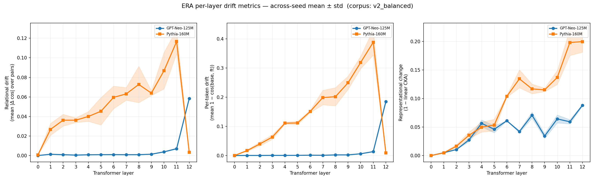

# Findings — Multi-Seed Cross-Model Study (corpus `v2_balanced`)

**Setup.** GPT-Neo-125M and Pythia-160M, both fine-tuned full-unfreeze on the
same symmetric 300-sentence biased corpus (`data/biased_corpus_v2_balanced.txt`),
**3 seeds each** (42, 43, 44). Both are 12-layer / 768-hidden decoder-only
transformers trained on the Pile, so the x-axis (layers 0–12) is shared and
the comparison isolates the *model family* under the same corpus and
intervention (architecture, tokenizer and pretraining remain a bundle — see
caveats). Metrics are per-layer, aggregated across
seeds as mean ± std (sample std, ddof=1, n=3 — the band is an *estimate* of
across-seed variability from a minimal sample).

**Provenance.** The per-cell artifacts (curves, per-context rows, v1-era
run configs — which record metrics, seed and corpus name but **no content
hashes**; the checkpoints were deleted, see
[`results/README.md`](../results/README.md) for the full statement of what
is and is not verifiable) are versioned under
`results/multiseed_v2_balanced/`; the aggregate numbers below come from
re-running `experiments/11_compare_multiseed.py` (current code) on those
cells.

## Headline

Two transformers, same corpus, same depth — **the injected bias reorganizes
their representations at different depths**, and the effect is stable across
seeds. But the conclusion is **metric-dependent**, which is the point of using
three metrics instead of one scalar.

## Depth centroids (where the change concentrates)

| Metric | GPT-Neo-125M | Pythia-160M | Separated? |
|--------|-------------:|------------:|:----------:|
| relational (Δ cos over pairs) | **11.04 ± 0.06** | **7.28 ± 0.25** | yes, ~3.8 layers |
| per-token (1 − cos base/ft)   | **11.68 ± 0.01** | **8.07 ± 0.15** | yes, ~3.6 layers |
| 1 − CKA (whole-layer change)  | 7.88 ± 0.06 | 8.66 ± 0.22 | smaller gap (0.78 layers), opposite sign, same direction in all three seeds |

(Layer index 0 = embedding output, 12 = final block. Higher centroid = change
concentrated later / nearer the output.)

## What the curves show

1. **Both models: drift grows with depth.** Near-zero at the embeddings, rising
   toward the top. Neither has a purely-middle peak — the injected bias is a
   late-ish phenomenon in both.

2. **GPT-Neo — extreme output-localized.** Relational drift is
   essentially flat (~0.0005–0.007) through layers 0–11, then **explodes ~8×** to
   0.058 at layer 12. Centroid 11.04, argmax = 12 for all three seeds, std tiny.
   The bias lives almost entirely at the final layer: the model changes *what it
   emits* without reorganizing intermediate concept geometry — the pattern
   predicted by the shallow-alignment hypothesis (a hypothesis under test,
   not a verdict ERA attaches).

3. **Pythia — distributed, peaks at 11, collapses at 12.** Relational drift rises
   steadily from layer 1 (0.027) to a peak at layer 11 (0.117), then **collapses
   at layer 12** (0.003). Centroid 7.28, argmax = 11 for all three seeds. The
   reorganization is spread across the mid-to-upper stack rather than dumped at
   the output — less output-localized.

4. **The difference is real, not seed noise.** On the cosine-based metrics the
   error bands are nowhere near overlapping (GPT-Neo 11.04 ± 0.06 vs Pythia
   7.28 ± 0.25). Per-token agrees. The *measured* difference is genuinely
   architectural — what it means is settled two sections below.

## The honest nuance — CKA disagrees

On rotation-invariant **CKA**, the two models are close (centroids 7.88 vs 8.66)
and the order even flips (GPT-Neo slightly *earlier*). So:

- **Angular/directional geometry** (cosine relational + per-token) reorganizes
  much later in GPT-Neo than in Pythia.
- **Overall representational change** (CKA) is distributed similarly in both.

Reading: GPT-Neo's whole-layer representations *do* change in the middle layers
(CKA sees it around layer 8), but in a way that **preserves the pairwise angular
geometry until the very last layer**, where a large angular reshuffle happens.
Pythia instead changes angular geometry progressively through the stack.

A concrete micro-observation supports this: at **Pythia layer 12** the cosine
metrics collapse to ~0 while **1 − CKA is at its maximum (0.20)**. That means
the final layer transforms the representation substantially (CKA) *without*
moving angles. Note the geometry precisely: linear CKA is *invariant* to a
global isotropic rescaling, so a simple uniform "scale change" cannot explain
this. Transformations that preserve all pairwise cosines but register on
centred CKA are **non-uniform** ones — e.g. per-token norm changes, or
movement along the shared mean direction that centring exposes. So the
correct reading is "angle-preserving but structurally non-trivial
reorganisation", not "simple rescaling". (Which specific transformation it
is remains unidentified; the LN probe below rules out one candidate.)

## Why the cosine curves look so different — it's largely anisotropy

A follow-up probe measured each base model's **per-layer anisotropy** (mean
pairwise cosine among token hidden states — how parallel the vectors are):

| Layer | … | 10 | 11 | **12** |
|-------|---|---:|---:|-------:|
| GPT-Neo-125M | ~0.99 (mid) | 0.985 | 0.971 | **0.684** |
| Pythia-160M  | ~0.71 (mid) | 0.712 | 0.709 | **0.991** |

*(Provenance caveat: this table comes from the original exploratory probe,
whose raw artifact was not preserved; treat the exact values as indicative.
What the preserved LN-probe artifact quoted below independently confirms is
the **final-layer contrast** — GPT-Neo comparatively open at layer 12 where
Pythia is extremely collapsed — not the full per-layer profile; the mid-layer
values rest on the unpreserved probe alone. The v2 pipeline now ships the
per-layer anisotropy diagnostics in every report, so any re-run reproduces
the complete profiles with full provenance.)*

The two profiles are **opposite**: GPT-Neo is collapsed (near-parallel) in the
*middle* layers and opens up at the output; Pythia is spread in the middle and
collapses at the *final* layer.

This confounds the cosine-based metrics. `relational = |cos_ft − cos_base|`; when
a layer is highly anisotropic, *all* pairwise cosines are ≈ 0.99 in both the base
and the poisoned model, so their difference is forced toward ≈ 0 regardless of
what changed. The metric **saturates**. Hence:

- **Pythia layer 12 ≈ 0** is a saturation artifact of extreme last-layer
  anisotropy (0.991), not an absence of change.
- **GPT-Neo's flat middle** is the same artifact (mid-layer anisotropy ≈ 0.99);
  its layer-12 spike appears because that layer opens up (0.684).

So the dramatic shape difference between the cosine curves largely tracks *where
each architecture is isotropic enough to measure*, not purely *where the bias
lands*. **CKA centres the representations, which removes the shared mean
direction — the specific mechanism that saturates the cosine views — and is
therefore the primary depth metric here** (less sensitive to this confound,
not infallible: the standard estimator is biased in high-dimension /
low-sample regimes, and every report records `n_cka_samples` for this
reason). And CKA says the two models are similar (centroids 7.9 vs 8.7),
both late.

## Bottom line (revised after the anisotropy probe)

- "**Pythia reorganizes earlier than GPT-Neo**" holds **only for angular
  (cosine) geometry, which is confounded by opposite per-layer anisotropy
  profiles** — so it is not by itself trustworthy evidence of deeper learning.
- On the **CKA metric — less sensitive to the anisotropy confound — the two
  models are similar**, both with late centroids (~8): both concentrate
  change late on the view that the shared mean direction cannot saturate.
- **Methodological takeaway for ERA:** cosine-based per-layer drift is confounded
  by per-layer anisotropy; report CKA (or centre the hidden states) for a
  trustworthy depth profile. This is exactly the kind of structure a single
  L2/L3 Alignment Score would have erased.

### Resolved: pre- vs post-final-LN probe (historical script, archived v1 repository)

We re-ran seed 42 with `--keep-checkpoints` and measured the layer-12 drift
**before** and **after** the final layer norm, plus the base-model anisotropy at
each stage (source artifact:
[`results/final_ln_probe_v2_balanced_seed42/final_ln_probe.json`](../results/final_ln_probe_v2_balanced_seed42/final_ln_probe.json);
note it was produced by the v1 probe code, whose measurement re-tokenised
context+candidate as text — a token-ID-safe v2 re-run confirms every
comparison's *direction* but not the identical digits, so read the table as
qualitative historical evidence):

| Model | relational pre-LN | relational post-LN | per-token pre-LN | per-token post-LN | anisotropy pre → post |
|-------|------------------:|-------------------:|-----------------:|------------------:|:---------------------:|
| GPT-Neo-125M | 0.0318 | 0.0582 | 0.1177 | 0.1865 | 0.81 → 0.66 |
| Pythia-160M  | 0.0075 | 0.0036 | 0.0186 | 0.0087 | 0.977 → 0.989 |

**Verdict — it is *not* a LayerNorm measurement-stage artifact.** For Pythia the
residual stream is *already* extremely anisotropic **before** the final LN
(0.977), and the cosine drift is already tiny pre-LN (0.0075). The LN does not
*create* the collapse — Pythia's final residual arrives near-1-dimensional on its
own. So the ~0 is **cosine saturation driven by intrinsic last-layer anisotropy**,
present in the residual stream itself.

Crucially, cosine ≈ 0 ≠ "nothing changed": CKA (which centres out the shared
anisotropic direction) is at its maximum (0.20) at Pythia layer 12 — real change
happens there, invisible to angles.

The GPT-Neo control confirms this by contrast: its final LN *reduces* anisotropy
(0.81 → 0.66, opening the space), and its layer-12 drift is real and even larger
post-LN (0.058) — a genuine change measured where cosine has room.

**Practical rule:** at layers with high anisotropy, lean on CKA (or centre
the hidden states) — it is less sensitive to the shared mean direction that
saturates the cosine views, though not immune to every geometry effect;
cosine-based drift there is saturated and must not be read as "no change".

## Caveats

1. **Three seeds is a minimum**, not a large sample; bands are estimates.
2. **Architecture is a bundle** (RoPE vs learned positions, dense vs local/global
   attention, parallel vs sequential blocks) — we observe that the package
   differs, not which factor causes it.
3. **Absolute drift heights are not comparable across architectures** (different
   embedding geometry); the analysis leads with shape / centroid, and the
   normalized shape plot (`multiseed_shape.png`, computed on 1 − CKA — the
   view less sensitive to shared-mean anisotropy — precisely because of the confound above) exists
   for this reason.
4. **One corpus** (normative, symmetric). A descriptive corpus, or held-out
   context families, could shift the picture.
