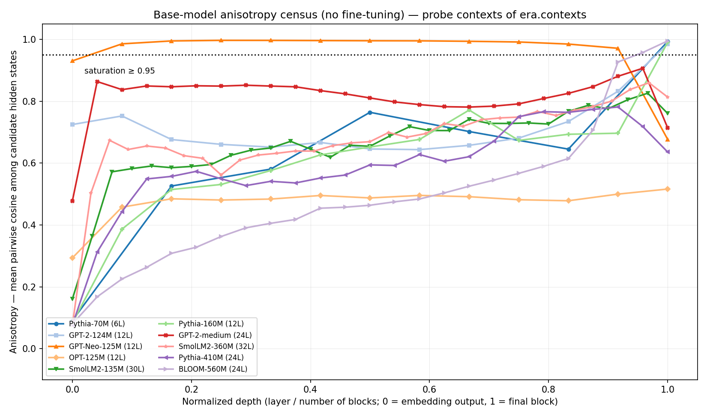

# Preflight + anisotropy census

_Generated: 2026-08-17T17:46:51Z — Windows AMD64, 12 logical CPUs, 10 torch threads, device `cpu`_

Inference only: **no model in this table was fine-tuned**. The census establishes that the v2 screen can run on each architecture, that the fixed probe set survives each tokenizer, and what each base model's per-layer anisotropy profile looks like.

## Anisotropy convention

For each of the 40 probe contexts in `era/contexts.py`, the candidate token IDs are the model's own semantic-filtered top-k next tokens (`top_k=20`, `era.models.is_semantic`). Each candidate is appended to the context **by token ID** and its hidden state is read at the final position of every layer. Anisotropy at a layer is the mean cosine over all candidate *pairs*, averaged over contexts.

This is the same computation as `anisotropy_base` in `era.pipeline.screen`, with one difference stated for the record: `screen` uses the **union** of the base and fine-tuned top-k sets, while a census has no fine-tuned model and therefore uses the base top-k alone. The measurement primitives are inherited from `era.models.ModelPair`, not re-implemented.

## Architecture census

| Model | Tier | Params | Blocks | Hidden | Positions | Vocab | Tokenizer pad |
|---|---|---:|---:|---:|---|---:|---|
| Pythia-70M | A | 70M | 6 | 512 | rotary | 50304 | eos (set by sweep) |
| GPT-2-124M | A | 124M | 12 | 768 | learned_absolute | 50257 | eos (set by sweep) |
| GPT-Neo-125M | reference | 125M | 12 | 768 | learned_absolute | 50257 | eos (set by sweep) |
| OPT-125M | A | 125M | 12 | 768 | learned_absolute | 50272 | native |
| SmolLM2-135M | A | 135M | 30 | 576 | rotary | 49152 | eos (set by sweep) |
| Pythia-160M | reference | 162M | 12 | 768 | rotary | 50304 | eos (set by sweep) |
| GPT-2-medium | B | 355M | 24 | 1024 | learned_absolute | 50257 | eos (set by sweep) |
| SmolLM2-360M | B | 362M | 32 | 960 | rotary | 49152 | eos (set by sweep) |
| Pythia-410M | B | 405M | 24 | 1024 | rotary | 50304 | eos (set by sweep) |
| BLOOM-560M | B | 559M | 24 | 1024 | alibi | 250880 | native |

## Probe-set health

`candidates` is the realized candidate count per context after the semantic top-k filter — the sample size the CKA estimator sees. It is tokenizer-dependent, so it is reported rather than assumed equal across architectures.

| Model | Context tokens (min/mean/max) | Degenerate contexts | Candidates (min/mean/max) | CKA samples |
|---|---|---:|---|---:|
| Pythia-70M | 6/8.0/12 | 0 | 20/20.0/20 | 800 |
| GPT-2-124M | 6/8.0/11 | 0 | 20/20.0/20 | 800 |
| GPT-Neo-125M | 6/8.0/11 | 0 | 20/20.0/20 | 800 |
| OPT-125M | 6/8.0/11 | 0 | 20/20.0/20 | 800 |
| SmolLM2-135M | 6/7.9/11 | 0 | 20/20.0/20 | 800 |
| Pythia-160M | 6/8.0/12 | 0 | 20/20.0/20 | 800 |
| GPT-2-medium | 6/8.0/11 | 0 | 20/20.0/20 | 800 |
| SmolLM2-360M | 6/7.9/11 | 0 | 20/20.0/20 | 800 |
| Pythia-410M | 6/8.0/12 | 0 | 20/20.0/20 | 800 |
| BLOOM-560M | 6/8.1/12 | 0 | 20/20.0/20 | 800 |

## Anisotropy profiles

`saturated layers` counts layers with mean pairwise cosine ≥ 0.95: there the cosine-based drift metrics are compressed toward zero regardless of what a fine-tune changed.

| Model | Blocks | min | mean | max | ≥0.9 | ≥0.95 | ≥0.99 | argmax depth |
|---|---:|---:|---:|---:|---:|---:|---:|---:|
| Pythia-70M | 6 | 0.091 | 0.615 | 0.993 | 1/7 | 1/7 | 1/7 | 1.00 |
| GPT-2-124M | 12 | 0.644 | 0.716 | 0.985 | 1/13 | 1/13 | 0/13 | 1.00 |
| GPT-Neo-125M | 12 | 0.677 | 0.962 | 0.997 | 12/13 | 11/13 | 8/13 | 0.25 |
| OPT-125M | 12 | 0.293 | 0.473 | 0.516 | 0/13 | 0/13 | 0/13 | 1.00 |
| SmolLM2-135M | 30 | 0.161 | 0.658 | 0.826 | 0/31 | 0/31 | 0/31 | 0.97 |
| Pythia-160M | 12 | 0.083 | 0.606 | 0.990 | 1/13 | 1/13 | 0/13 | 1.00 |
| GPT-2-medium | 24 | 0.478 | 0.812 | 0.907 | 1/25 | 0/25 | 0/25 | 0.96 |
| SmolLM2-360M | 32 | 0.076 | 0.675 | 0.860 | 0/33 | 0/33 | 0/33 | 0.97 |
| Pythia-410M | 24 | 0.076 | 0.587 | 0.782 | 0/25 | 0/25 | 0/25 | 0.92 |
| BLOOM-560M | 24 | 0.080 | 0.489 | 0.995 | 3/25 | 2/25 | 1/25 | 1.00 |

The preregistered threshold is **0.95** (docs/PREDICTIONS.md); the neighbouring columns are a sensitivity check, not alternative results to choose between after the fact.

## Estimated sweep schedule — COARSE ESTIMATE

> **This is a coarse estimate, not a benchmark.** It is extrapolated from the median of 3 timed optimizer steps after a single warm-up step. It does **not** replace the Phase 1b benchmark (one complete Pythia-70M cell run end-to-end after preregistration), and no scheduling decision about Tier B should rest on it alone.

Corpus `biased_corpus_v2_balanced.txt`, hyperparameters read from `experiments/10_multiseed_sweep.py` (MAX_LENGTH=128, BATCH_SIZE=4, EPOCHS=3, LR=5e-05). The batch *shape* is exact (`padding="max_length"` fixes every batch at BATCH_SIZE x MAX_LENGTH); what the estimate omits is Trainer overhead, per-epoch evaluation, dataloading, checkpoint serialisation, and — on a 15 W laptop CPU — thermal throttling over a multi-hour run. Three steps also cannot see run-to-run variance. Expect the true wall-clock to exceed these numbers, plausibly by a large factor on the Tier B models; Phase 1b exists to measure that factor rather than guess it.

| Model | Seeds | s/step | steps/seed | train/seed | screen/seed | total |
|---|---:|---:|---:|---:|---:|---:|
| Pythia-70M | 3 | 1.01 | 219 | 0h03m | 0h00m | 0h19m |
| GPT-2-124M | 3 | 5.50 | 219 | 0h20m | 0h03m | 1h20m |
| GPT-Neo-125M | 3 | 2.42 | 219 | 0h08m | 0h01m | 0h32m |
| OPT-125M | 3 | 5.62 | 219 | 0h20m | 0h04m | 1h18m |
| SmolLM2-135M | 3 | 4.08 | 219 | 0h14m | 0h02m | 0h57m |
| Pythia-160M | 3 | 2.95 | 219 | 0h10m | 0h01m | 0h36m |
| GPT-2-medium | 2 | 11.98 | 219 | 0h43m | 0h06m | 1h54m |
| SmolLM2-360M | 2 | 10.86 | 219 | 0h39m | 0h07m | 1h39m |
| Pythia-410M | 2 | 11.73 | 219 | 0h42m | 0h05m | 1h48m |
| BLOOM-560M | 2 | 26.44 | 219 | 1h36m | 0h08m | 3h39m |

**Estimated total wall-clock for the listed models: 14h07m.**

## Skipped models

| Model | HF id | Stage | Reason |
|---|---|---|---|
| Cerebras-GPT-111M | `cerebras/Cerebras-GPT-111M` | roster | HTTP 401 from the hub API: the whole Cerebras-GPT series is gated (cerebras/Cerebras-GPT-111M, -256M and cerebras/btlm-3b-8k-base all return 401 while the cerebras org itself lists publicly). No unauthenticated download is possible, and the community re-uploads are themselves fine-tuned, so they cannot stand in for a base model. Consequence: the panel carries no muP-trained architecture, and no claim about training-recipe generality can be made from it. |
| OPT-350M | `facebook/opt-350m` | census | ValueError: Hidden states are not of uniform dimensionality across layers: [512, 1024]. era.metrics.cosine_similarity requires equal-length vectors, so this architecture cannot be screened layer-by-layer as-is. |

## Caveats

1. The anisotropy profile is a property of the **base** model and the **probe contexts**; it is not a claim about any fine-tune.
2. Candidate sets differ across models by construction (each model's own top-k). Anisotropy is therefore measured on a model-specific token sample, which is the same convention the pipeline uses but is not a controlled comparison of identical tokens.
3. Timings are for this machine only and scale with thread count and thermal headroom; a laptop CPU throttles over a long sweep.
